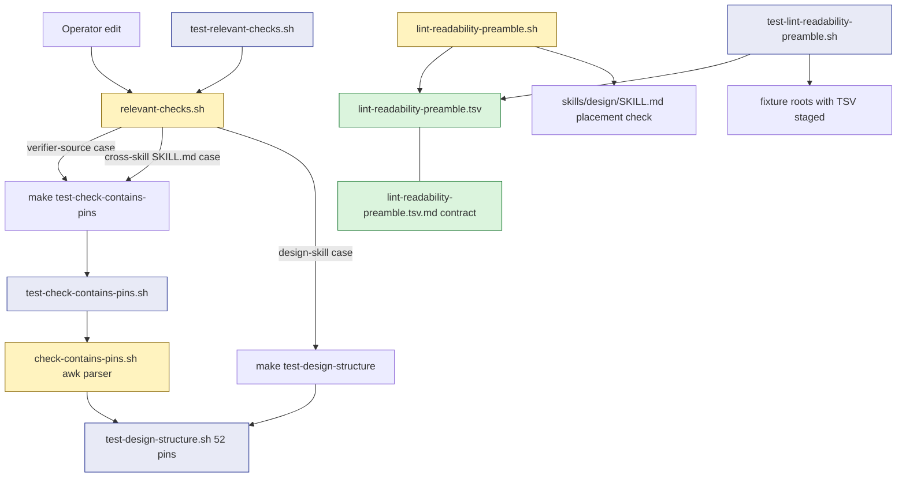

## Goal
Implement issue #3091: [IMPLEMENTING] [OOS] CI lint hardening: check-contains-pins routing + lint-readability-preamble counting/placement/manifest dedup\n\n## Combined Out-of-Scope Observation.

## Implementation Plan
## Plan

Tier: SIMPLE. Close all 6 acceptance items in #3091 (combined from #3087 and #3080) with surgical changes to two lint scripts, their harnesses, and `relevant-checks.sh` routing. The 11 accepted plan-review findings have been applied to this plan.

### Files to modify/create

#### UPDATED: `scripts/check-contains-pins.sh`
- **Escape-aware closing-quote scan for double-quoted literals.** Replace `literal_end = index(rest, quote)` in `parse_contains` with a char-by-char scanner that walks `rest` one character at a time, tracking `\\` escapes; the literal ends at the first UNESCAPED `"`. Single-quoted literal scanning stays as-is.
- **Bare-dollar detection on ORIGINAL source.** While the scanner walks the double-quoted source, set a `bare_dollar` flag when a `$` is encountered that is NOT preceded by `\`. After capturing the closing position, apply the unescape pass (`\$`→`$`, `\"`→`"`, `\\`→`\`) to the captured body.
- **CHECK vs SKIP decision.** SKIP only when `bare_dollar` was set on the ORIGINAL source. Literals containing only `\$` escapes are CHECKable (bash unescapes them to literal `$` at runtime).
- **Trailing backslash**: unterminated → SKIP. **Non-recognized escape** (`\n`, `\t`, etc.): leave the two-char sequence literal, matching bash double-quote semantics.

#### UPDATED: `scripts/check-contains-pins.md`
- Update the canonical-grammar paragraph: static double-quoted literals are supported including bash double-quote escapes (`\$`, `\"`, `\\`); double-quoted literals with an UNESCAPED `$` remain `SKIPPED_NON_CANONICAL`.

#### UPDATED: `scripts/test-check-contains-pins.sh`
- Section 5 (6 fixtures): `escape-dollar-only`, `escape-quotes-only`, `escape-backslash`, `escape-defect`, `escape-with-bare-dollar` (mixed escaped + bare `$` → SKIP), `escape-quote-inside-literal` (escaped `\"` mid-literal does NOT terminate).
- Section 6 (1 fixture): re-run a happy-path under `BASH_COMPAT=3.2 bash`; assert identical exit code. Documented as informational smoke; `make lint-bash32` + Section 4 forbidden-token assertions remain the portability gate.

#### UPDATED: `scripts/relevant-checks.sh`
- Keep the existing design-skill arm unchanged at `skills/design/SKILL.md|skills/design/references/*.md` → `test-design-structure`.
- Add a new case block for verifier/harness/canonical-pin-source edits. Pattern: `scripts/check-contains-pins.sh`, `scripts/check-contains-pins.md`, `scripts/test-check-contains-pins.sh`, `scripts/test-check-contains-pins.md`, `scripts/test-design-structure.sh`. Routes to `test-check-contains-pins`. **Do NOT include** `scripts/test-parse-codex-usage.sh`.
- Add a separate broader case block for cross-skill pin verification: pattern `skills/*/SKILL.md|skills/*/references/*.md`, routes to `test-check-contains-pins` only (NOT `test-design-structure`).

#### UPDATED: `scripts/relevant-checks.md`
- Document the new verifier-source case and the cross-skill `test-check-contains-pins` routing; note the design choice (design-structure stays design-scoped; pin verification is the cross-skill mechanism).

#### UPDATED: `scripts/test-relevant-checks.sh`
- Update existing direct-target assertion(s) to reflect the new routing. Add 2 positive cases (`check-contains-pins.sh` change routes to `test-check-contains-pins`; non-design `skills/<other>/SKILL.md` change routes to `test-check-contains-pins` but not `test-design-structure`) and 1 negative case (`test-parse-codex-usage.sh` does NOT route).

#### UPDATED: `scripts/test-relevant-checks.md`
- Document the new test cases.

#### NEW: `scripts/lint-readability-preamble.tsv`
- Tab-separated manifest. Comment (`#`) and blank lines skipped. 5 columns: `path`, `variant`, `expected_count`, `prompt_kind`, `step_markers`. All 5 columns ALWAYS present per row; empty optional fields are literal empty strings.
- Rows: 7 orchestrator-inline (SKILL.md with `step_markers=2b,3b,4,5`; 6 other references with empty `step_markers`); 4 external-prompt (brainstorm-prompts/3/standard, sketch-prompts/4/sketch, dialectic-debate/2/standard, plan-review/1/plan-review).

#### NEW: `scripts/lint-readability-preamble.tsv.md`
- Sibling `.md` per script-md-siblings rule.
- Documents the shared TSV-reader contract that BOTH `lint-readability-preamble.sh` AND `test-lint-readability-preamble.sh` must implement identically: awk-based field parsing (NOT `IFS=$'\t' read`), comment/blank-line skip, `expected_count` validation rejecting empty and non-digit (`''|*[!0-9]*` → exit 2), `prompt_kind` and `step_markers` semantics, edit-in-sync rules with SKILL.md step IDs.

#### UPDATED: `scripts/lint-readability-preamble.sh`
- Remove inline `manifest_rows=(...)` Bash array. Replace with an awk-based TSV reader that preserves empty middle fields. Validate `expected_count` (`''|*[!0-9]*` → exit 2 with diagnostic).
- Add `sketch_style_line='Style requirements: <READABILITY_STYLE>.'` (no backticks); distinct from `external_style_line` (backticked).
- Switch sketch variant from `grep -Foc '<READABILITY_STYLE>'` to `grep -Fc "$sketch_style_line"` (per-line line-anchored).
- Add step-marker placement check (awk-based; Bash 3.2 portable) gated on `variant == orchestrator-inline` AND non-empty `step_markers`. For each step ID, find `<!-- step:<id> ` marker, treat lines until the next `<!-- step:` line as the step body, count `orchestrator_style_re` matches; require ≥1 per named step. Clear error message when a referenced step marker is absent from the file.

#### UPDATED: `scripts/lint-readability-preamble.md`
- Document the manifest-TSV move, sketch line-anchoring change, step-marker placement check, awk-based reader, `expected_count` validation. Reference the shared contract in `lint-readability-preamble.tsv.md`.

#### UPDATED: `scripts/test-lint-readability-preamble.sh`
- Remove duplicated `external_paths` / `orchestrator_paths` lists. Replace with awk-based TSV reader (identical contract per FINDING_13) that parses the same TSV.
- Helper `stage_manifest <root>`: copies repo TSV (or a variant) into `$root/scripts/lint-readability-preamble.tsv` before each lint invocation.
- Helper `write_skill_md_with_steps <root> <count_per_step>`: writes SKILL.md fixture with `<!-- step:2b -->` / `<!-- step:3b -->` / `<!-- step:4 -->` / `<!-- step:5 -->` markers and directives between each pair.
- Sketch fixture uses `sketch_style_line` (no backticks); standard external-prompt fixture keeps backticked `external_style_line`.
- New test cases: A4 sketch line-anchoring (`sketch-bare-token-rejected`), B5 placement-missing-step, B5 placement-correct-count-correct-placement, B6 extended source-of-truth (extra TSV row generates fixture via `stage_manifest`; negative-control skips parsing one row → lint fails because fixture is absent), malformed-TSV-row case (empty `expected_count` → exit 2).
- Existing 5 test cases continue to pass after the refactor (with `orchestrator-partial` adjusted to distribute directives across step bodies so the file-level count mismatch fires but placement does not).

#### UPDATED: `scripts/test-lint-readability-preamble.md`
- Document new test cases.

#### UPDATED: `scripts/test-design-structure.sh`
- No new structural pin lines required — existing line 44 becomes a passing pin after A1 lands. Add a short comment near line 44 noting the A1 exercise (no behavior change).

### Architecture

The data flow is straightforward: `relevant-checks.sh` dispatches changed files to make targets, which invoke harness scripts, which invoke the lint/verifier scripts, which consume the manifest TSV (for readability lint) or the test scripts directly (for pin verification).

### Edge cases

- Empty `step_markers`: file-level count only; placement check skipped.
- TSV comments / blank lines: skipped via awk filter.
- A1 trailing backslash: SKIP. A1 `\X` for unrecognized X: literal two chars. A1 escaped `\"` mid-literal: scanner does not terminate.
- A1 mixed escaped + bare `$`: original-source scan sets `bare_dollar`; emits SKIP.
- B5 stale step ID in manifest: clear error `<file>: step "<id>": ... marker not found`. Fails closed.
- B6 awk parsing: empty middle fields preserved (Bash `IFS=$'\t' read` is rejected as collapsing).

### Failure modes

1. **A1 escape-aware scanner regressing the canonical no-`$` double-quoted literal path.** A scanner bug could silently truncate previously-correct literals. **Signal**: Section 1 happy-path tests fail. **Mitigation**: existing Section 1 fixtures must pass; new `escape-quote-inside-literal` exercises the mid-literal escape case.
2. **B5 step-marker false positives during SKILL.md refactors.** Stale `step_markers` after a step rename fails lint. **Signal**: pre-commit `step "<id>": ... marker not found`. **Mitigation**: error names the exact step ID + TSV path; TSV `.md` documents edit-in-sync.
3. **B6 TSV reader divergence between lint and test.** Different awk filter or field extraction → asymmetric acceptance. **Signal**: extended B6 case fails. **Mitigation**: identical awk filter `NF >= 1 && $1 !~ /^#/ && $0 != ""`; canonical contract documented in TSV `.md`; harness asserts row-count parity with lint iteration.

### Testing strategy

- Existing harnesses must keep passing (test-check-contains-pins Sections 1-4, test-lint-readability-preamble 5 cases, test-design-structure 52 pins, `make lint-bash32`).
- A1: 6 new fixtures in Section 5; A3: 1 new fixture in Section 6.
- A4 + B5 + B6: 5 new fixtures in `test-lint-readability-preamble.sh` (sketch-bare-token-rejected, placement-missing-step, placement-correct-count-correct-placement, B6 extended source-of-truth + negative control, malformed-TSV-row).
- `test-relevant-checks.sh`: 3 new cases (verifier-source, non-design SKILL.md, negative for test-parse-codex-usage.sh).
- Real-repo smoke: `bash scripts/check-contains-pins.sh`, `bash scripts/lint-readability-preamble.sh`, `bash scripts/test-relevant-checks.sh` must all exit 0.
- Pre-commit: `make lint`, `make test-check-contains-pins`, `make test-lint-readability-preamble`, `make test-relevant-checks`, `make lint-bash32`, `make lint-readability-preamble` all pass.

## Acceptance

- `check-contains-pins.sh` correctly verifies double-quoted static literals that contain bash double-quote escapes (`\$`, `\"`, `\\`); literals with unescaped `$` continue to skip.
- `relevant-checks.sh` routes pin-bearing edits beyond `skills/design/` to the verifier (`test-check-contains-pins`), while `test-design-structure` remains design-scoped.
- `test-check-contains-pins.sh` invokes the script under a restricted or Bash-3.2-equivalent shell (`BASH_COMPAT=3.2 bash`) for at least one case, with the smoke documented as informational while `make lint-bash32` remains the portability gate.
- `lint-readability-preamble.sh` enforces exact line presence (`grep -Fc "$sketch_style_line"`) for the sketch variant rather than substring token count.
- `lint-readability-preamble.sh` enforces placement at each per-step composition site for `orchestrator-inline` rows whose `step_markers` is non-empty (SKILL.md today), not just file-level counts.
- The manifest path list in `lint-readability-preamble.sh` and the fixture path sets in `test-lint-readability-preamble.sh` are kept in sync mechanically via the shared `scripts/lint-readability-preamble.tsv` (consumed by both with an identical awk-based reader documented in the sibling `.md`).

diff_lines: 420

## Test plan
(no test plan section in plan-file)
