## /implement run B1935C06-5C82-402B-BC64-DB95673204FB — bailed

- **Outcome**: bailed
- **Mode**: N/A
- **Duration**: 07:37:33
- **Cost**: 💰 TOTAL ~$171.56 — Claude $40.68, Codex $63.77, Cursor $55.50, Claude (subprocess) $11.61  |  Tokens: 257372k
- **Issue**: #3992 — https://github.com/character-ai/larch/issues/3992
- **PR**: #4209 — https://github.com/character-ai/larch/pull/4209
- **Plan review**: N/A
- **Code review**: 73/101 accepted
- **Lines (PR diff)**: code +2869/-125, larch-logs +4075/-0
- **OOS filed**: 0
- **Exec issues**: 0
- **Warnings**: 0
- **Run logs**: `larch-logs/implement/B1935C06-5C82-402B-BC64-DB95673204FB/`

<!-- larch:run-summary v=1 -->

## Review Phase Detail

| Round | Suggestions | Accepted | OOS proposed | OOS accepted | Time | Cost | Reviewers |
|--:|--:|--:|--:|--:|:--|--:|--:|
| 1 | 47 | 32 | 0 | 0 | 40m 35s | $23.47 | 12 |
| 2 | 20 | 16 | 0 | 0 | 41m 27s | $12.84 | 7 |
| 3 | 21 | 12 | 0 | 0 | 38m 01s | $14.83 | 7 |
| 4 | 24 | 9 | 0 | 0 | 1h 09m 13s | $15.32 | 7 |
| 5 | 18 | 6 | 0 | 0 | 37m 44s | $15.85 | 7 |
| **Total** | **130** | **75** | **0** | **0** | **3h 47m 00s** | **$82.31** | **40** |

### Round 1 reviewer timing

```mermaid
gantt
    title Round 1 reviewer timing
    dateFormat X
    axisFormat %H:%M:%S
    section Reviewers
    cursor/testing :r1_t1, 2, 134
    codex/dyn-tierb-safety-codex :r1_t2, 2, 161
    cursor/dyn-tierb-safety :r1_t3, 2, 161
    cursor/edge-cases :r1_t4, 2, 168
    cursor/correctness :r1_t5, 2, 176
    cursor/dyn-kv-cleanliness :r1_t6, 2, 188
    cursor/dyn-design-reporting :r1_t7, 2, 196
    codex/correctness :r1_t8, 2, 213
    codex/edge-cases :r1_t9, 2, 230
    codex/dyn-design-reporting-codex :r1_t10, 2, 231
    codex/testing :r1_t11, 2, 244
    codex/dyn-kv-cleanliness-codex :r1_t12, 2, 277
    unknown/aggregator :r1_t13, 288, 378
    cursor/vote :r1_t14, 380, 500
    codex/vote :r1_t15, 380, 581
    claude/vote :r1_t16, 380, 719
    unknown/codex.out :r1_t17, 1294, 1295
    claude/ci.out :r1_t18, 1295, 1296
    unknown/out :r1_t19, 1296, 1297
    cursor/ci.out :r1_t20, 1297, 1298
    unknown/codex.log :r1_t21, 1355, 1460
    claude/ci.out :r1_t22, 1550, 1551
    claude/ci.out :r1_t23, 1551, 1552
    cursor/ci.out :r1_t24, 1553, 1555
    unknown/codex.log :r1_t25, 1815, 1865
```

### Round 2 reviewer timing

```mermaid
gantt
    title Round 2 reviewer timing
    dateFormat X
    axisFormat %H:%M:%S
    section Reviewers
    cursor/testing :r2_t1, 1, 164
    cursor/dyn-design-reporting :r2_t2, 1, 169
    cursor/correctness :r2_t3, 1, 203
    cursor/dyn-kv-cleanliness :r2_t4, 1, 223
    codex/codex-generic :r2_t5, 1, 294
    cursor/dyn-tierb-safety :r2_t6, 1, 307
    cursor/edge-cases :r2_t7, 1, 307
    unknown/aggregator :r2_t8, 313, 399
    cursor/vote :r2_t9, 400, 491
    codex/vote :r2_t10, 400, 577
    claude/vote :r2_t11, 400, 990
    unknown/codex.log :r2_t12, 1906, 1922
    unknown/out :r2_t13, 2058, 2059
    cursor/ci.out :r2_t14, 2059, 2061
```

### Round 3 reviewer timing

```mermaid
gantt
    title Round 3 reviewer timing
    dateFormat X
    axisFormat %H:%M:%S
    section Reviewers
    cursor/testing :r3_t1, 2, 144
    cursor/dyn-kv-cleanliness :r3_t2, 2, 197
    cursor/dyn-tierb-safety :r3_t3, 2, 231
    cursor/dyn-design-reporting :r3_t4, 2, 236
    cursor/correctness :r3_t5, 2, 380
    cursor/edge-cases :r3_t6, 2, 387
    codex/codex-generic :r3_t7, 2, 423
    unknown/aggregator :r3_t8, 433, 548
    cursor/vote :r3_t9, 550, 694
    codex/vote :r3_t10, 550, 805
    claude/vote :r3_t11, 550, 1106
    unknown/codex.log :r3_t12, 1705, 1735
    unknown/out :r3_t13, 1842, 1843
    cursor/ci.out :r3_t14, 1843, 1844
```

### Round 4 reviewer timing

```mermaid
gantt
    title Round 4 reviewer timing
    dateFormat X
    axisFormat %H:%M:%S
    section Reviewers
    cursor/testing :r4_t1, 3, 117
    cursor/correctness :r4_t2, 3, 182
    cursor/dyn-tierb-safety :r4_t3, 3, 188
    cursor/dyn-design-reporting :r4_t4, 3, 213
    cursor/edge-cases :r4_t5, 3, 222
    cursor/dyn-kv-cleanliness :r4_t6, 3, 225
    codex/codex-generic :r4_t7, 3, 432
    unknown/aggregator :r4_t8, 442, 560
    cursor/vote :r4_t9, 562, 685
    codex/vote :r4_t10, 562, 853
    claude/vote :r4_t11, 562, 1422
    unknown/codex.log :r4_t12, 2795, 2993
    unknown/codex.log :r4_t13, 3110, 3157
    cursor/ci.out :r4_t14, 3302, 3304
```

### Round 5 reviewer timing

```mermaid
gantt
    title Round 5 reviewer timing
    dateFormat X
    axisFormat %H:%M:%S
    section Reviewers
    cursor/testing :r5_t1, 4, 156
    cursor/correctness :r5_t2, 4, 172
    cursor/edge-cases :r5_t3, 4, 182
    cursor/dyn-design-reporting :r5_t4, 4, 225
    codex/codex-generic :r5_t5, 4, 298
    cursor/dyn-tierb-safety :r5_t6, 4, 386
    cursor/dyn-kv-cleanliness :r5_t7, 4, 526
    unknown/aggregator :r5_t8, 537, 625
    claude/vote :r5_t9, 627, 1345
    cursor/vote :r5_t10, 628, 739
    codex/vote :r5_t11, 628, 905
    unknown/codex.log :r5_t12, 1607, 1633
    unknown/out :r5_t13, 1741, 1742
    cursor/ci.out :r5_t14, 1742, 1743
```

**Top reviewers** (by suggestions accepted, whole run):
1. cursor/dyn-design-reporting — 15
2. cursor/testing — 15
3. cursor/correctness — 14
4. codex/codex-generic — 9
5. cursor/edge-cases — 9
6. cursor/dyn-tierb-safety — 7
7. codex/edge-cases — 6

**Reviewer slot failures**: 0

_Cost is the per-round vendor cost (Codex + Cursor + Claude subprocess), attributed by token-ledger timestamp window; it excludes main-agent Claude, so it is less than the run Cost line above. Rendered as an em dash when per-round timing or the token ledger is unavailable._
