## /implement run C0AEE353-0827-41FA-8180-3AD41556D246 — bailed

- **Outcome**: bailed
- **Mode**: N/A
- **Duration**: 00:22:27
- **Cost**: 💰 TOTAL ~$12.08 — Claude $2.42, Codex $6.03, Cursor $2.50, Claude (subprocess) $1.13  |  Tokens: 13538k
- **Issue**: #4097 — https://github.com/character-ai/larch/issues/4097
- **Plan review**: N/A
- **Code review**: 1/1 accepted
- **Lines (PR diff)**: N/A
- **OOS filed**: 1 — https://github.com/character-ai/larch/issues/4173\\n-
- **Exec issues**: 0
- **Warnings**: 0
- **Run logs**: `larch-logs/implement/C0AEE353-0827-41FA-8180-3AD41556D246/`

<!-- larch:run-summary v=1 -->

## Review Phase Detail

| Round | Suggestions | Accepted | OOS proposed | OOS accepted | Time | Cost | Reviewers |
|--:|--:|--:|--:|--:|:--|--:|--:|
| 1 | 7 | 2 | 0 | 0 | 10m 13s | $6.28 | 10 |
| **Total** | **7** | **2** | **0** | **0** | **10m 13s** | **$6.28** | **10** |

### Round 1 reviewer timing

```mermaid
gantt
    title Round 1 reviewer timing
    dateFormat X
    axisFormat %H:%M:%S
    section Reviewers
    codex/dyn-scout-normalizer-codex :r1_t1, 3, 93
    codex/dyn-stdout-envelope-codex :r1_t2, 3, 111
    codex/testing :r1_t3, 3, 124
    codex/edge-cases :r1_t4, 3, 126
    cursor/edge-cases :r1_t5, 3, 130
    cursor/correctness :r1_t6, 3, 135
    cursor/dyn-stdout-envelope :r1_t7, 3, 142
    cursor/dyn-scout-normalizer :r1_t8, 3, 200
    codex/correctness :r1_t9, 3, 209
    cursor/testing :r1_t10, 3, 221
    codex/impl-transcript :r1_t11, 81, 85
    codex/impl-transcript :r1_t12, 89, 90
    codex/impl-transcript :r1_t13, 93, 95
    codex/impl-transcript :r1_t14, 98, 99
    codex/impl-transcript :r1_t15, 102, 104
    codex/impl-transcript :r1_t16, 106, 107
    codex/impl-transcript :r1_t17, 108, 109
    codex/impl-transcript :r1_t18, 112, 113
    codex/impl-transcript :r1_t19, 118, 119
    codex/impl-transcript :r1_t20, 120, 121
    codex/impl-transcript :r1_t21, 123, 124
    cursor/impl-transcript :r1_t22, 142, 143
    codex/impl-transcript :r1_t23, 145, 146
    codex/impl-transcript :r1_t24, 147, 148
    codex/impl-transcript :r1_t25, 149, 150
```

**Top reviewers** (by suggestions accepted, whole run):
1. codex/correctness — 1

**Reviewer slot failures**: 0

_Cost is the per-round vendor cost (Codex + Cursor + Claude subprocess), attributed by token-ledger timestamp window; it excludes main-agent Claude, so it is less than the run Cost line above. Rendered as an em dash when per-round timing or the token ledger is unavailable._
