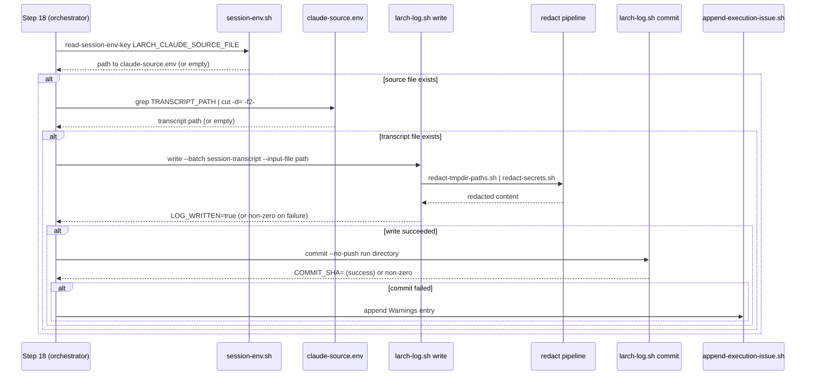

## Architecture Diagram

Architecture diagram not available.

## Code Flow Diagram

```mermaid
sequenceDiagram
    participant S18 as Step 18 (orchestrator)
    participant SE as session-env.sh
    participant CS as claude-source.env
    participant LL as larch-log.sh write
    participant RD as redact pipeline
    participant LC as larch-log.sh commit
    participant EI as append-execution-issue.sh

    S18->>SE: read-session-env-key LARCH_CLAUDE_SOURCE_FILE
    SE-->>S18: path to claude-source.env (or empty)
    alt source file exists
        S18->>CS: grep TRANSCRIPT_PATH | cut -d= -f2-
        CS-->>S18: transcript path (or empty)
        alt transcript file exists
            S18->>LL: write --batch session-transcript --input-file path
            LL->>RD: redact-tmpdir-paths.sh | redact-secrets.sh
            RD-->>LL: redacted content
            LL-->>S18: LOG_WRITTEN=true (or non-zero on failure)
            alt write succeeded
                S18->>LC: commit --no-push run directory
                LC-->>S18: COMMIT_SHA= (success) or non-zero
                alt commit failed
                    S18->>EI: append Warnings entry
                end
            end
        end
    end
```
