## /implement run CCA7F151-2AC8-40A4-9E6F-5F7EA85921DD — bailed

- **Outcome**: bailed
- **Mode**: N/A
- **Duration**: 00:46:52
- **Cost**: 💰 TOTAL ~$28.99 — Claude $2.28, Codex $19.95, Cursor $4.90, Claude (subprocess) $1.86  |  Tokens: 39349k
- **Issue**: #4102 — https://github.com/character-ai/larch/issues/4102
- **Plan review**: N/A
- **Code review**: 1/1 accepted
- **Lines (PR diff)**: N/A
- **OOS filed**: 1 — https://github.com/character-ai/larch/issues/4164
- **Exec issues**: 0
- **Warnings**: 0
- **Run logs**: `larch-logs/implement/CCA7F151-2AC8-40A4-9E6F-5F7EA85921DD/`

<!-- larch:run-summary v=1 -->

## Review Phase Detail

| Round | Suggestions | Accepted | OOS proposed | OOS accepted | Time | Cost | Reviewers |
|--:|--:|--:|--:|--:|:--|--:|--:|
| 1 | 14 | 6 | 0 | 0 | 18m 52s | $17.53 | 10 |
| **Total** | **14** | **6** | **0** | **0** | **18m 52s** | **$17.53** | **10** |

### Round 1 reviewer timing

```mermaid
gantt
    title Round 1 reviewer timing
    dateFormat X
    axisFormat %H:%M:%S
    section Reviewers
    cursor/edge-cases :r1_t1, 2, 218
    cursor/testing :r1_t2, 2, 273
    cursor/correctness :r1_t3, 2, 284
    codex/edge-cases :r1_t4, 2, 295
    codex/correctness :r1_t5, 2, 374
    codex/dyn-warning-surface-codex :r1_t6, 3, 191
    codex/dyn-ledger-routing-codex :r1_t7, 3, 243
    cursor/dyn-ledger-routing :r1_t8, 3, 274
    cursor/dyn-warning-surface :r1_t9, 3, 284
    codex/testing :r1_t10, 3, 373
    unknown/aggregator :r1_t11, 382, 435
    cursor/vote :r1_t12, 437, 529
    codex/vote :r1_t13, 437, 647
    claude/vote :r1_t14, 437, 723
    cursor/ci.out :r1_t15, 1019, 1021
```

**Top reviewers** (by suggestions accepted, whole run):
1. codex/correctness — 1
2. codex/edge-cases — 1
3. cursor/correctness — 1
4. cursor/dyn-warning-surface — 1

**Reviewer slot failures**: 0

_Cost is the per-round vendor cost (Codex + Cursor + Claude subprocess), attributed by token-ledger timestamp window; it excludes main-agent Claude, so it is less than the run Cost line above. Rendered as an em dash when per-round timing or the token ledger is unavailable._
