## /implement run D4D6A472-290F-44B8-8CCD-E4678BF2713E — bailed

- **Outcome**: bailed
- **Mode**: N/A
- **Duration**: 00:41:52
- **Cost**: 💰 TOTAL ~$20.85 — Claude $2.33, Codex $11.70, Cursor $4.77, Claude (subprocess) $2.05  |  Tokens: 26162k
- **Issue**: #4101 — https://github.com/character-ai/larch/issues/4101
- **Plan review**: N/A
- **Code review**: 1/1 accepted
- **Lines (PR diff)**: N/A
- **OOS filed**: 1
- **Exec issues**: 0
- **Warnings**: 0
- **Run logs**: `larch-logs/implement/D4D6A472-290F-44B8-8CCD-E4678BF2713E/`

<!-- larch:run-summary v=1 -->

## Review Phase Detail

| Round | Suggestions | Accepted | OOS proposed | OOS accepted | Time | Cost | Reviewers |
|--:|--:|--:|--:|--:|:--|--:|--:|
| 1 | 11 | 2 | 0 | 0 | 24m 55s | $15.24 | 10 |
| **Total** | **11** | **2** | **0** | **0** | **24m 55s** | **$15.24** | **10** |

### Round 1 reviewer timing

```mermaid
gantt
    title Round 1 reviewer timing
    dateFormat X
    axisFormat %H:%M:%S
    section Reviewers
    unknown/scout-round1-manifest.json.raw :r1_t1, 2, 61
    unknown/scout-round1-manifest.json.raw :r1_t2, 61, 224
    cursor/dyn-risk-integration :r1_t3, 226, 352
    cursor/edge-cases :r1_t4, 226, 376
    cursor/dyn-architecture :r1_t5, 226, 415
    cursor/testing :r1_t6, 226, 446
    dynamic/risk-integration-codex :r1_t7, 226, 451
    cursor/correctness :r1_t8, 226, 495
    codex/correctness :r1_t9, 226, 509
    codex/dyn-architecture-codex :r1_t10, 226, 509
    codex/edge-cases :r1_t11, 226, 517
    codex/testing :r1_t12, 226, 583
    unknown/aggregator :r1_t13, 593, 668
    cursor/vote :r1_t14, 671, 775
    codex/vote :r1_t15, 671, 824
    claude/vote :r1_t16, 671, 997
    unknown/codex.log :r1_t17, 1215, 1230
    unknown/claude.out :r1_t18, 1391, 1392
    unknown/codex.out :r1_t19, 1393, 1394
    cursor/ci.out :r1_t20, 1396, 1398
```

**Top reviewers** (by suggestions accepted, whole run):
1. codex/correctness — 1
2. cursor/correctness — 1

**Reviewer slot failures**: 0

_Cost is the per-round vendor cost (Codex + Cursor + Claude subprocess), attributed by token-ledger timestamp window; it excludes main-agent Claude, so it is less than the run Cost line above. Rendered as an em dash when per-round timing or the token ledger is unavailable._
