## /implement run DC3EA277-E9A5-49F6-8C45-EC91AF586B91 — bailed

- **Outcome**: bailed
- **Mode**: N/A
- **Duration**: 00:50:22
- **Cost**: 💰 TOTAL ~$26.50 — Claude $2.19, Codex $18.40, Cursor $4.19, Claude (subprocess) $1.72  |  Tokens: 34500k
- **Issue**: #4104 — https://github.com/character-ai/larch/issues/4104
- **Plan review**: N/A
- **Code review**: 1/5 accepted
- **Lines (PR diff)**: N/A
- **OOS filed**: 1 — https://github.com/character-ai/larch/issues/4159\\n-
- **Exec issues**: 0
- **Warnings**: 0
- **Run logs**: `larch-logs/implement/DC3EA277-E9A5-49F6-8C45-EC91AF586B91/`

<!-- larch:run-summary v=1 -->

## Review Phase Detail

| Round | Suggestions | Accepted | OOS proposed | OOS accepted | Time | Cost | Reviewers |
|--:|--:|--:|--:|--:|:--|--:|--:|
| 1 | 13 | 2 | 0 | 0 | 21m 05s | $16.38 | 10 |
| **Total** | **13** | **2** | **0** | **0** | **21m 05s** | **$16.38** | **10** |

### Round 1 reviewer timing

```mermaid
gantt
    title Round 1 reviewer timing
    dateFormat X
    axisFormat %H:%M:%S
    section Reviewers
    cursor/correctness :r1_t1, 2, 211
    cursor/edge-cases :r1_t2, 2, 217
    codex/edge-cases :r1_t3, 2, 281
    codex/correctness :r1_t4, 2, 342
    codex/dyn-launcher-harness-codex :r1_t5, 3, 145
    cursor/dyn-timing-ledger :r1_t6, 3, 182
    cursor/dyn-launcher-harness :r1_t7, 3, 188
    cursor/testing :r1_t8, 3, 202
    codex/testing :r1_t9, 3, 265
    codex/dyn-timing-ledger-codex :r1_t10, 3, 282
    unknown/aggregator :r1_t11, 351, 419
    claude/vote :r1_t12, 420, 812
    cursor/vote :r1_t13, 421, 517
    codex/vote :r1_t14, 421, 615
```

**Top reviewers** (by suggestions accepted, whole run):
1. cursor/dyn-timing-ledger — 1

**Reviewer slot failures**: 0

_Cost is the per-round vendor cost (Codex + Cursor + Claude subprocess), attributed by token-ledger timestamp window; it excludes main-agent Claude, so it is less than the run Cost line above. Rendered as an em dash when per-round timing or the token ledger is unavailable._
