## /implement run E23BDFB8-C18B-4E53-BF12-7A8707E2E2FE — bailed

- **Outcome**: bailed
- **Mode**: N/A
- **Duration**: 00:42:35
- **Cost**: 💰 TOTAL ~$18.13 — Claude $2.97, Codex $11.94, Cursor $1.62, Claude (subprocess) $1.60  |  Tokens: 20298k
- **Issue**: #4180 — https://github.com/character-ai/larch/issues/4180
- **PR**: #4195 — https://github.com/character-ai/larch/pull/4195
- **Plan review**: N/A
- **Code review**: 1/1 accepted
- **Lines (PR diff)**: code +207/-10, larch-logs +766/-0
- **OOS filed**: 0
- **Exec issues**: 0
- **Warnings**: 0
- **Run logs**: `larch-logs/implement/E23BDFB8-C18B-4E53-BF12-7A8707E2E2FE/`

<!-- larch:run-summary v=1 -->

## Review Phase Detail

| Round | Suggestions | Accepted | OOS proposed | OOS accepted | Time | Cost | Reviewers |
|--:|--:|--:|--:|--:|:--|--:|--:|
| 1 | 12 | 1 | 0 | 0 | 17m 09s | $12.85 | 8 |
| **Total** | **12** | **1** | **0** | **0** | **17m 09s** | **$12.85** | **8** |

### Round 1 reviewer timing

```mermaid
gantt
    title Round 1 reviewer timing
    dateFormat X
    axisFormat %H:%M:%S
    section Reviewers
    cursor/testing :r1_t1, 4, 124
    cursor/dyn-teardown-safety :r1_t2, 4, 184
    codex/dyn-teardown-safety-codex :r1_t3, 4, 186
    cursor/edge-cases :r1_t4, 4, 198
    cursor/correctness :r1_t5, 4, 264
    codex/testing :r1_t6, 4, 275
    codex/correctness :r1_t7, 4, 293
    codex/edge-cases :r1_t8, 4, 344
    codex/dyn-teardown-safety-codex :r1_t9, 16, 168
    cursor/testing :r1_t10, 16, 177
    cursor/correctness :r1_t11, 16, 195
    cursor/edge-cases :r1_t12, 16, 214
    cursor/dyn-teardown-safety :r1_t13, 16, 247
    codex/correctness :r1_t14, 16, 272
    codex/testing :r1_t15, 16, 289
    codex/edge-cases :r1_t16, 16, 347
    unknown/aggregator :r1_t17, 356, 400
    unknown/aggregator :r1_t18, 357, 406
    unknown/aggregator-output-retry :r1_t19, 401, 441
    cursor/vote :r1_t20, 407, 476
    codex/vote :r1_t21, 407, 541
    claude/vote :r1_t22, 407, 570
    cursor/vote :r1_t23, 443, 515
    codex/vote :r1_t24, 443, 568
    claude/vote :r1_t25, 443, 576
```

**Top reviewers** (by suggestions accepted, whole run):
1. cursor/correctness — 1
2. cursor/dyn-teardown-safety — 1
3. cursor/testing — 1

**Reviewer slot failures**: 0

_Cost is the per-round vendor cost (Codex + Cursor + Claude subprocess), attributed by token-ledger timestamp window; it excludes main-agent Claude, so it is less than the run Cost line above. Rendered as an em dash when per-round timing or the token ledger is unavailable._
