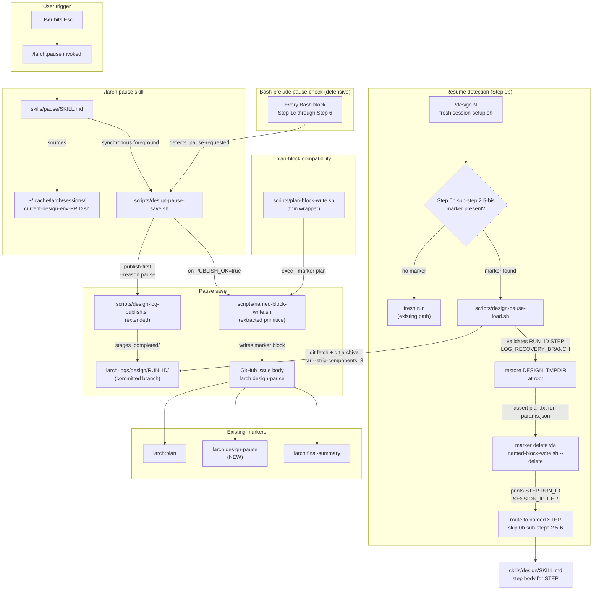

## Goal
Implement issue #2959: [IMPLEMENTING] Brainstorm how to add ability to pause to /design, so it can save its state in issue, retain temp directory, and resume later\n\n<!-- larch:plan:start -->.

## Implementation Plan
## Plan

# Implementation Plan — issue #2959: Add pause/resume to `/design`

Cross-session, user-initiated pause and resume for the `/design` skill, with a generic helper surface that `/implement` and `/review` can later adopt.

## Approach

A thin checkpoint layer over the existing state model — no new workflow engine. State has two homes: bulk artifacts (including `.completed/` progress sentinels) live in the existing `larch-logs/design/<RUN_ID>/` branch via the extended publish path, and a tiny `<!-- larch:design-pause -->` marker block in the issue body holds the pointer. The user triggers pause by hitting Esc then invoking `/larch:pause` (new tiny skill) which runs `scripts/design-pause-save.sh` **synchronously and directly** against the live session env — there is no `.pause-requested` flag-then-defer indirection (this addresses FINDING_17 by eliminating the orphaned-flag failure mode entirely). A defensive `.pause-requested` sentinel + Bash-prelude pause-check remains for the rare corner case where `/larch:pause` is invoked while `/design` is still actively running between Bash boundaries (e.g. under `/loop`); in that case the prelude self-saves at the next boundary.

`design-pause-save.sh` runs `design-log-publish.sh --reason pause` FIRST (publish-first ordering — atomic commit point is the marker), then on `PUBLISH_OK=true` writes the `<!-- larch:design-pause -->` block to the issue body via the new `scripts/named-block-write.sh`. On `PUBLISH_OK=false` with a non-empty `RECOVERY_BRANCH`, the script records `LOG_RECOVERY_BRANCH=<name>` inside the marker payload before writing so resume can fetch from the recovery branch. The save script emits `PAUSE_OK=true|false` and `ERROR=…` on stdout (FINDING_6 contract). All failures route through `scripts/append-tool-failure.sh`.

Resume detection lives **early** in Step 0b — immediately after issue fetch (sub-step 2) and **before** the title-eligibility filter (sub-step 2.5). When the issue body contains `<!-- larch:design-pause:start -->`, `scripts/design-pause-load.sh` runs; on `LOAD_OK=true`, Step 0b skips sub-steps 2.5 through 6 (no clarify-loop, no already-planned router, no tier-gate, no `run-params.json` re-write, no `[DESIGNING]` rename — all of those state mutations are already persisted in the restored tmpdir) and the orchestrator routes directly to the named `STEP=<id>`. This addresses FINDING_1's full surface: paused `[DESIGNING]` issues never trip the lifecycle-reject filter, and resumed runs never re-enter clarify / tier / run-param flows.

The loader fetches the snapshot by `git fetch origin <ref>` followed by `git archive` from the local object (or `git checkout-index`) — **not** `git archive --remote`, which GitHub does not support (FINDING_2). Extraction uses `tar --strip-components=3 -C "$DESIGN_TMPDIR"` so files like `plan.txt` and `run-params.json` land at the tmpdir root, not under `larch-logs/design/<RUN_ID>/...` (FINDING_3). After restore, the loader asserts required root files (`plan.txt`, `run-params.json`, `pause-state.txt`) exist before deleting the marker — failed assertion exits with `LOAD_OK=false` `ERROR=missing-restored-artifact`.

The shared helper `scripts/named-block-write.sh` is parameterized by `--marker NAME` (validated against `^[a-z0-9][a-z0-9-]*$` per FINDING_13 with a small registry `plan|design-pause` initially documented) and accepts an explicit `--delete` flag (FINDING_12) — empty `--content-file` keeps the existing `plan-block-write.sh` semantics (replaces block with start/end markers only). Delete is **only** invoked by `design-pause-load.sh` for the `design-pause` marker. `plan-block-write.sh` collapses to a 5-line thin wrapper passing `--marker plan`; the wrapper preserves the existing CLI surface and `WRITTEN/MODE/MARKERS_PRESENT/BODY_BYTES/MALFORMED/FAILED/ERROR` stdout contract bit-for-bit, with all five malformed token outcomes (`multiple-start`, `multiple-end`, `start-without-end`, `end-without-start`, `end-before-start` — FINDING_22) preserved.

`design-log-publish.sh` gains `--reason {final,pause}` (default `final`). On `pause`: commit subject changes, `manifest.json` adds `paused=true`, and the staging path is extended to also enumerate `$DESIGN_TMPDIR/.completed/` files into `RUN_DEST/.completed/` (FINDING_15 — progress sentinels survive pause cycles). Existing-remote-branch reuse is handled via fetch-and-force-with-lease push (FINDING_11). All existing `PUBLISH_OK` / `PR_NUMBER` / `PR_URL` / `RECOVERY_BRANCH` post-conditions preserved.

**Critical**: per FINDING_10, `.completed/step-<id>` sentinels are written **only at step success boundaries**, not at step entry. Pause-save computes the resume `STEP` by walking `step-name-registry.tsv` in **file order** (FINDING_7) and selecting the first step whose `.completed/step-<id>` sentinel is absent. A pause mid-step-X correctly resumes at step-X (because `.completed/step-X` is absent), causing step-X to fully re-execute — consistent with Decision 5's abandon-in-flight semantics.

Pause helpers accept `--design-tmpdir` (required), `--issue` (required), and `--repo OWNER/REPO` (optional, threaded through to `named-block-write.sh`, `gh issue view`, and `design-log-publish.sh` — FINDING_4). `/design`'s Step 0b resolves `REPO` via the existing `scripts/resolve-repo.sh` (already done elsewhere in Step 0b clarify) and threads it through pause save/load.

Marker payload values (`RUN_ID`, `STEP`, `LOG_RECOVERY_BRANCH`) are **validated** before any git command (FINDING_20): `RUN_ID` via `larch_log_slug_is_valid` from `lib-larch-log.sh`; `STEP` via lookup in `step-name-registry.tsv`; `LOG_RECOVERY_BRANCH` via `git check-ref-format` plus an enforced `larch-log-design-` prefix. Option-looking (`--`-prefixed) and path-containing (`../`, `/`) values are rejected before any subprocess.

The canonical Bash-block prelude gains a second line — the pause-check — appended after the existing `source` line. SKILL.md currently has ~29 Bash fences from Step 1c through Step 6 (FINDING_18); the plan enumerates each fence by line range to patch, and a new structure test (added to `scripts/test-design-structure.sh`) asserts every `^\s*\[ -f ~/.cache/.../current-design-env-\$PPID\.sh \]` fence is immediately followed by the pause-check line. CI fails if any drifts.

**ISSUE_NUMBER refresh** (FINDING_9): Step 0b sub-step 5.5 (after `[DESIGNING]` rename) gains a mandatory `write-design-current-env.sh --issue-number "$ISSUE_NUMBER" --claude-pid "$PPID"` re-invocation so the env file always has `ISSUE_NUMBER` exported before any Step 1c+ Bash boundary. The pause harness covers a fresh-env-no-issue scenario to assert the refresh is present.

## Files to modify/create

### NEW: `scripts/named-block-write.sh`
Parameterized block-edit primitive extracted from `plan-block-write.sh`. Argv: `--marker NAME` (validated against `^[a-z0-9][a-z0-9-]*$`; registry: `plan`, `design-pause`), `--issue N`, `[--content-file PATH]`, `[--delete]`, `[--repo OWNER/REPO]`. `--delete` and `--content-file` are mutually exclusive; at least one required. When `--delete` is passed AND the marker block is present, the script removes the block (no insertion) and emits `MODE=removed`. When `--content-file` is passed: behavior matches the existing `plan-block-write.sh` — empty content replaces the block with start/end markers only (`MODE=replaced` or `MODE=appended`), preserving existing semantics for `--marker plan`. Marker grammar: `<!-- larch:<NAME>:start -->` … `<!-- larch:<NAME>:end -->`. Stdout: `WRITTEN/MODE/MARKERS_PRESENT/BODY_BYTES/MALFORMED/FAILED/ERROR` with all five malformed tokens (`multiple-start`, `multiple-end`, `start-without-end`, `end-without-start`, `end-before-start`). Always pipes through `scripts/redact-secrets.sh` before `gh issue edit --body-file <tmp>` (file-backed per `gh-body-file.md`). Single-shot `gh` calls — no retry (FINDING_14). `set -euo pipefail`.

### NEW: `scripts/named-block-write.md`
Sibling contract. Documents the marker registry (`plan`, `design-pause`), the strict marker-name validation regex, the `--delete` vs empty-`--content-file` semantics distinction, the five malformed exit conditions, the single-shot non-retry contract, and the redaction invariant. Lists current callers: `scripts/plan-block-write.sh` (thin wrapper), `scripts/design-pause-save.sh`, `scripts/design-pause-load.sh`.

### NEW: `scripts/design-pause-save.sh`
Argv: `--design-tmpdir PATH` (required), `--issue N` (required), `[--repo OWNER/REPO]`. Composes redacted `pause-state.txt` in `$DESIGN_TMPDIR` (KV: `STEP`, `SESSION_ID`, `RUN_ID`, `TIER`, `BRAINSTORM_DONE`, `BODY_HASH`, `PAUSED_AT`). Computes `STEP` by walking `skills/design/scripts/step-name-registry.tsv` in **file order** and selecting the first step whose `$DESIGN_TMPDIR/.completed/step-<id>` sentinel is absent. Invokes `scripts/design-log-publish.sh --reason pause --design-tmpdir "$DESIGN_TMPDIR" --run-id "$RUN_ID" --issue "$ISSUE" [--repo "$REPO"]`. On `PUBLISH_OK=true`: writes the marker via `scripts/named-block-write.sh --marker design-pause --content-file <redacted-pause-state> --issue "$ISSUE" [--repo "$REPO"]`. On `PUBLISH_OK=false` with non-empty `RECOVERY_BRANCH`: records `LOG_RECOVERY_BRANCH=<name>` into the pause-state payload before writing, marker still goes through; the snapshot is recoverable from the branch. On `PUBLISH_OK=false` with no `RECOVERY_BRANCH`: marker is NOT written; `PAUSE_OK=false` `ERROR=publish-and-recovery-failed`. Stdout: `PAUSE_OK=true|false`, `ERROR=<reason>` (when false), `STEP=<id>` (when true), `RUN_ID=<id>` (when true). Logs all failures via `scripts/append-tool-failure.sh` (Tool Failures category). Removes `$DESIGN_TMPDIR/.pause-requested` on success. `set -euo pipefail`.

### NEW: `scripts/design-pause-save.md`
Sibling contract. Documents argv, the publish-first ordering invariant, the `RECOVERY_BRANCH` fallback path, the `PAUSE_OK/ERROR/STEP/RUN_ID` stdout contract, and the failure-logging contract. Notes that the script is normally invoked directly by `/larch:pause` (synchronous), and defensively by the canonical Bash-prelude pause-check.

### NEW: `scripts/design-pause-load.sh`
Argv: `--design-tmpdir PATH` (required, the freshly-allocated tmpdir from Step 0a), `--issue N` (required), `[--repo OWNER/REPO]`. Reads issue body via `gh issue view "$ISSUE" --json body [--repo "$REPO"]`. Parses `<!-- larch:design-pause:start -->` … `<!-- larch:design-pause:end -->` payload into KV. **Validates** each value before any git command: `RUN_ID` via `larch_log_slug_is_valid`; `STEP` via lookup in `step-name-registry.tsv`; `LOG_RECOVERY_BRANCH` (when present) via `git check-ref-format` + enforced `larch-log-design-` prefix. Verifies `BODY_HASH` against the body-with-marker-stripped sha256; mismatch emits `WARN=body-drift` on stdout and continues. Fetches snapshot: `git fetch origin <ref>` where `<ref>` is `LOG_RECOVERY_BRANCH` when set, else `origin/<default>`; extracts via `git archive <ref> larch-logs/design/<RUN_ID>/ | tar -x --strip-components=3 -C "$DESIGN_TMPDIR"`. Asserts `plan.txt`, `run-params.json`, `pause-state.txt` exist at tmpdir root post-extract; on missing → `LOAD_OK=false` `ERROR=missing-restored-artifact`. Atomically deletes marker via `scripts/named-block-write.sh --marker design-pause --delete --issue "$ISSUE" [--repo "$REPO"]`. Stdout: `LOAD_OK=true|false`, `STEP=<id>`, `SESSION_ID=<orig>`, `RUN_ID=<orig>`, `TIER=<orig>`, `BRAINSTORM_DONE=<orig>`, `WARN=<token>` (when body-drift), `ERROR=<reason>` (when false). Exits 0 even on failure so the caller can route to "start fresh" with a warning. `set -euo pipefail`.

### NEW: `scripts/design-pause-load.md`
Sibling contract. Documents the warn-but-continue `BODY_HASH` semantics, the `LOG_RECOVERY_BRANCH` fallback fetch path, the `git fetch + git archive + tar --strip-components=3` extraction recipe (FINDING_2/3), the strict marker-value validation rules (FINDING_20), the atomic marker-delete invariant, the post-extract assertion list, and the `LOAD_OK=false` ERROR codes.

### NEW: `skills/pause/SKILL.md`
Registers the `/larch:pause` skill (~120 lines orchestrator-side). Body: source `~/.cache/larch/sessions/current-design-env-$PPID.sh`; if absent OR if `DESIGN_TMPDIR` / `ISSUE_NUMBER` are unset, emit `**ℹ /larch:pause: no live /design session detected on this PID; nothing to pause.**` and exit 0. Resolve `REPO` via `scripts/resolve-repo.sh` (best-effort, optional). Print one-line breadcrumb `🛑 /larch:pause: saving state for issue #<N>…`. Invoke `scripts/design-pause-save.sh --design-tmpdir "$DESIGN_TMPDIR" --issue "$ISSUE_NUMBER" [--repo "$REPO"]` SYNCHRONOUSLY (foreground Bash, no `run_in_background`). Parse stdout for `PAUSE_OK=`; on true print `✅ /larch:pause: state saved (STEP=<id>, RUN_ID=<id>) — re-invoke /design <N> to resume`; on false print `**⚠ /larch:pause: save failed — <ERROR>; see $DESIGN_TMPDIR/execution-issues.md**` and exit 1. Takes no arguments.

### NEW: `skills/design/scripts/test-design-pause-resume.sh`
Round-trip harness. Test cases (each exercises `design-pause-save.sh` + `design-pause-load.sh` with local stubs for `gh`, `git archive`, and `design-log-publish.sh`):
- (a) Clean save: `PUBLISH_OK=true` from publish, marker block written, `pause-state.txt` redacted, sentinel survives, `.completed/` directory staged.
- (b) `BODY_HASH` drift: between save and load, mutate the issue body; load emits `WARN=body-drift` on stdout and continues with `LOAD_OK=true`.
- (c) Explicit `--delete`: `named-block-write.sh --marker design-pause --delete` returns `MODE=removed` when marker present, `MODE=absent-noop` (or equivalent) when marker absent.
- (d) Empty `--content-file` keeps `--marker plan` semantics (no inadvertent delete via the wrapper).
- (e) Malformed marker block (5 malformed tokens — multiple-start, multiple-end, start-without-end, end-without-start, end-before-start): all five produce exit 1 with the documented `MALFORMED=` token.
- (f) Graceful publish-failure: `PUBLISH_OK=false` with `RECOVERY_BRANCH=foo` → marker written WITH `LOG_RECOVERY_BRANCH=foo`; on load, fetch routes to `origin/foo` instead of default branch.
- (g) Hard publish-failure: `PUBLISH_OK=false` and no `RECOVERY_BRANCH` → marker NOT written, `PAUSE_OK=false` `ERROR=publish-and-recovery-failed`.
- (h) Post-extract assertion: when restored tarball is missing `plan.txt`, load emits `LOAD_OK=false` `ERROR=missing-restored-artifact`.
- (i) Marker-name validation: `--marker BAD/NAME` rejected before any gh calls.
- (j) Value validation: `RUN_ID` containing `../`, `STEP` not in registry, `LOG_RECOVERY_BRANCH` without `larch-log-design-` prefix → all rejected with explicit ERROR.
- (k) Unbounded cycles: save → load → save → load (each cycle writes a fresh marker; `.completed/` from cycle 1 is preserved into cycle 2's snapshot).
- (l) `.completed/` staging: after `design-log-publish.sh --reason pause`, verify the staged log branch contains `.completed/step-1c`, `step-1d`, etc. (mirrors of what was on disk).
- (m) Resume step ordering: with `.completed/{step-1c,step-2a}` present, save picks `STEP=1d` (file order from registry, not lexicographic).
- (n) `ISSUE_NUMBER` refresh: load assumes a freshly-allocated tmpdir whose source-env was rewritten with `--issue-number $ISSUE_NUMBER` per the Step 0b refresh.
`set -euo pipefail`. Registered as a Makefile target on a `test-harnesses-N` shard.

### NEW: `skills/design/scripts/test-design-pause-resume.md`
Sibling stub pointing at the primary contracts in `scripts/design-pause-save.md` / `scripts/design-pause-load.md`.

### REWRITTEN: `scripts/plan-block-write.sh`
Collapse the entire current body to a thin wrapper:
```bash
#!/usr/bin/env bash
set -euo pipefail
SCRIPT_DIR=$(cd "$(dirname "${BASH_SOURCE[0]}")" && pwd)
exec "$SCRIPT_DIR/named-block-write.sh" --marker plan "$@"
```
The wrapper preserves the existing `--issue` / `--content-file` / `--repo` CLI surface and the `WRITTEN/MODE/MARKERS_PRESENT/BODY_BYTES/MALFORMED/FAILED/ERROR` stdout contract bit-for-bit. No `--delete` is exposed through the wrapper (callers wanting delete must use `named-block-write.sh` directly with an explicit marker).

### UPDATED: `scripts/plan-block-write.md`
Add one paragraph noting the script is now a thin wrapper over `named-block-write.sh --marker plan` and that the full contract — including `--delete`, marker validation, and the five malformed tokens — lives in `scripts/named-block-write.md`. Note that stderr messages now originate from `named-block-write.sh` (FINDING_24 acknowledgement — exonerated by voters but doc-noted anyway).

### UPDATED: `scripts/design-log-publish.sh`
Add `--reason {final,pause}` argv flag (default `final`). Four branch points:
1. **Commit message** (line ~451): `chore(larch-logs): pause design run ${RUN_ID} [skip ci]` when reason is pause.
2. **Manifest** (jq line ~421): when reason is pause, also set `.paused = true`. **Always-set guarantee even on empty-porcelain early-exit path** is intentionally NOT added here — FINDING_5 was exonerated; pause-save's marker write is the canonical "paused" signal, not the manifest field. (Documented in `design-log-publish.md`.)
3. **Existing remote branch / open PR handling** (around line 159-169 + push at 469): when reason is pause AND `$WT_BRANCH` already exists locally or remotely, the path does `git fetch origin "$WT_BRANCH"` and then `git push --force-with-lease origin "$WT_BRANCH"` instead of `branch -D`-failure. Existing open PRs against the same branch are reused (gh pr list + reuse the PR number). FINDING_11.
4. **`.completed/` staging**: add a new directory enumeration block parallel to the existing `plan-review/` and `render-cache/` paths. Stage `$DESIGN_TMPDIR/.completed/*` into `$RUN_DEST/.completed/` only when `--reason pause` (or always — TBD during implementation; staging it always is harmless and simplifies the harness). FINDING_15.

All existing `PUBLISH_OK` / `PR_NUMBER` / `PR_URL` / `RECOVERY_BRANCH` post-conditions preserved.

### UPDATED: `scripts/design-log-publish.md`
Document the new `--reason {final,pause}` flag, the four branch points, the force-with-lease remote-branch handling, and the `.completed/` staging path. Note pause callers MUST pass `--reason pause`. Clarify that `manifest.paused` is NOT set on the empty-porcelain early-exit path (FINDING_5 exoneration rationale).

### UPDATED: `skills/design/SKILL.md`
Four classes of edits:
1. **Step 0b sub-step 2.5-bis (NEW)**: Insert a new "Resume detection" sub-step **immediately after sub-step 2 (issue fetch) and BEFORE sub-step 2.5 (title-eligibility filter)** (FINDING_1). When the issue body contains `<!-- larch:design-pause:start -->`: source `scripts/resolve-repo.sh` for `REPO`; run `scripts/design-pause-load.sh --design-tmpdir "$DESIGN_TMPDIR" --issue "$ISSUE_NUMBER" --repo "$REPO"`; parse `LOAD_OK=`. On `LOAD_OK=true`: re-export `SESSION_ID`, `RUN_ID`, `TIER`, `BRAINSTORM_DONE` from loader stdout; re-run `scripts/write-design-current-env.sh` to refresh the env symlink with restored values; print `🔓 resumed from STEP=<id>`; **skip Step 0b sub-steps 2.5 through 6** (title filter, clarify, already-planned router, tier-gate, [DESIGNING] rename, run-params write); branch directly to the named step. On `LOAD_OK=false`: print the WARN, continue as fresh run (do NOT bypass sub-step 2.5).
2. **Step 0b sub-step 5.5-bis (NEW)**: Immediately after the `[DESIGNING]` rename, add a mandatory `scripts/write-design-current-env.sh --output "$DESIGN_TMPDIR/source-env.sh" --design-tmpdir "$DESIGN_TMPDIR" --session-id "$SESSION_ID" --issue-number "$ISSUE_NUMBER" --claude-pid "$PPID" [reviewer flags]` re-invocation (FINDING_9). Without this, `/larch:pause` can't find `ISSUE_NUMBER` from the env symlink.
3. **Canonical Bash-prelude — append pause-check**: Extend the prelude line (currently a single `[ -f ~/.cache/.../current-design-env-$PPID.sh ] && source …`) to a **two-line** prelude with the pause-check appended:
   ```bash
   [ -f ~/.cache/larch/sessions/current-design-env-$PPID.sh ] && source ~/.cache/larch/sessions/current-design-env-$PPID.sh
   [ -f "$DESIGN_TMPDIR/.pause-requested" ] && exec "$CLAUDE_PLUGIN_ROOT/scripts/design-pause-save.sh" --design-tmpdir "$DESIGN_TMPDIR" --issue "$ISSUE_NUMBER"
   ```
   Patch every Bash fence from Step 1c through Step 6 (FINDING_18 — enumerate inline). Step 0 fences do NOT include the pause-check (no `DESIGN_TMPDIR` yet). The implementation must enumerate all current `[ -f ~/.cache/larch/sessions/current-design-env-$PPID.sh ]` lines in `skills/design/SKILL.md` (currently ~29 of them between Step 1c and Step 6) and append the pause-check immediately below each.
4. **`.completed/` writes — move from step ENTRY to step SUCCESS BOUNDARY** (FINDING_10). Each step's terminal Bash boundary writes its own sentinel. Specifically: at the **end** of Step 1c body write `: > "$DESIGN_TMPDIR/.completed/step-1c"`; at the end of Step 1d body write `step-1d`; etc. for `1d.5`, `1e`, `2a`, `2a.5`, `2b`, `2b.5`, `3`, `3.5`, `3b`, `4`, `4b`, `5b`, `5c`, `5d`, `6`. Use existing `.brainstorm-done` and `.step3-entry-plan-printed` as concurrent additional signals (no rename of those). Step 5 is decomposed into `5b`, `5c`, `5d` substep sentinels (FINDING_8) rather than a single `step-5`.
5. **Anti-patterns entry (NEW)**: Add: "NEVER omit the pause-check line from the canonical Bash-block prelude (Step 1c onward). **Why**: pause/resume relies on the orchestrator self-terminating at the next Bash boundary; missing this line means a pause request invoked during an in-flight `/design` is silently dropped until the run completes naturally. **How to apply**: every Bash block from Step 1c through Step 6 starts with the two-line prelude (source env, then pause-check). The `scripts/test-design-structure.sh` harness enforces this — see its `assert_bash_fences_have_pause_check` test case."

### UPDATED: `skills/design/scripts/step-name-registry.tsv`
Add rows in **file order** for the steps currently absent: `0c\tscan`, `5b\toos`, `5c\tplan write`, `5d\tl3 velocity`. Ensure the registry order matches the canonical execution order so `design-pause-save.sh`'s in-order walk picks the correct resume step (FINDING_7, FINDING_8). Total: ~4 new lines.

### UPDATED: `scripts/test-design-structure.sh`
Add two assertions:
- `assert_bash_fences_have_pause_check`: greps `skills/design/SKILL.md` for every `[ -f ~/.cache/larch/sessions/current-design-env-$PPID.sh ]` line between the `<!-- step:1c` marker and the `<!-- step:6` marker (or end-of-file); asserts each is immediately followed by a `[ -f "$DESIGN_TMPDIR/.pause-requested" ] && exec` line.
- `assert_step_completion_sentinels`: greps `skills/design/SKILL.md` for `.completed/step-<id>` writes; asserts at least one write per step id `1c`, `1d`, `1d.5`, `1e`, `2a`, `2a.5`, `2b`, `2b.5`, `3`, `3.5`, `3b`, `4`, `4b`, `5b`, `5c`, `5d`, `6`.

### UPDATED: `Makefile`
Add target `test-design-pause-resume` invoking `bash skills/design/scripts/test-design-pause-resume.sh`. Add to one `test-harnesses-N` shard (pick the same shard as `test-design-driver` or `test-plan-block`). Add `.PHONY` entry. Update agent-lint allowlists if the new script's path is not already covered.

### UPDATED: `scripts/test-design-log-publish.sh`
Add fixture cases for `--reason pause`: commit-subject contains `pause design run`, manifest contains `paused=true`, `.completed/` staging visible in the test commit, force-with-lease push reuses an existing remote-branch fixture.

### UPDATED: `README.md`
Add `/larch:pause` row to the skills table — short description ("Pause a running /design; saves state to GitHub for cross-session resume"), arguments (none), source link to `skills/pause/SKILL.md`.

### UPDATED: `docs/skills.md`
Add a section for `/larch:pause` mirroring the structure used for `/larch:design` and other skills — description, arguments, behavior, related skills.

### UPDATED: `docs/issue-anchored-plan.md`
Add `larch:design-pause` to the LIVE wire-format catalog alongside `larch:plan`. Document the marker grammar, the KV payload schema, and the body-hash semantics. Note that pause markers are written and consumed by `/design` only (not by `/implement`).

### UPDATED: `AGENTS.md`
Append `larch:design-pause` to the canonical-marker catalog reference. Add one bullet to "Common editing tasks" noting `/design` pause/resume is documented in `skills/pause/SKILL.md` and the wire format lives in `docs/issue-anchored-plan.md`. ~5 lines net change.

### UPDATED: `.claude/rules/gh-body-file.md`
Add `scripts/named-block-write.sh` and `scripts/named-block-write.md` to the `paths:` frontmatter so future edits to the new shared writer see the body-file invariant reminder (FINDING_25). Also document the new caller in the maintenance section.

## Edge cases

- **Empty issue body when pause writes marker** — `named-block-write.sh` `MODE=appended` path handles empty bodies. Marker becomes the entire body.
- **Issue body grows past `<!-- larch:plan -->` block during pause** — `BODY_HASH` mismatch on resume → `WARN=body-drift` and proceed (Decision 8 — marker wins).
- **`/larch:pause` invoked when no `/design` is running** — env symlink absent OR `DESIGN_TMPDIR` empty → skill prints info banner and exits 0.
- **`/larch:pause` invoked twice in quick succession (e.g. user types pause, Enter, pause, Enter)** — each invocation acquires its own session env; second's `design-pause-save.sh` either sees the marker already present (idempotent overwrite via `MODE=replaced`) or errors loudly if the prior save left the tmpdir half-clean. Test (k) covers cycle idempotency.
- **`design-pause-save.sh` invoked during Step 0 or 0a** — no `DESIGN_TMPDIR` yet by construction. The script exits 1 `ERROR=tmpdir-unset` if invoked there.
- **Pause during Step 5b/5c/5d** — pause-save records `STEP=5b` (or 5c/5d) based on `.completed/` sentinels. Resume re-enters the named substep. Step 5c is idempotent on already-published `larch:plan` content; Step 5d's sentinel-based gate prevents duplicate comment posts.
- **Pause during Step 6 cleanup** — Step 6 removes `$DESIGN_TMPDIR`, which destroys `.pause-requested`. Pause requested during Step 6 either fires before cleanup or after (silently dropped — design is complete).
- **Multi-machine race** — single-runner invariant per `AGENTS.md` is the existing protection.
- **Marker written but log-publish PR not yet merged** — `design-pause-load.sh` consults `LOG_RECOVERY_BRANCH` first; on absent → falls back to `origin/<default>`; on absent there too → `LOAD_OK=false` `ERROR=snapshot-not-found`.
- **`gh` transient failure during pause-save** — single-shot per FINDING_14; user retries `/larch:pause`. Documented in `named-block-write.md`.
- **`/larch:pause` invoked inside a `/design` sub-shell** (rare, e.g. via skill composition) — env symlink points at the outer Claude PID, not the sub-shell; the skill's `$PPID` mismatch causes the source to fail gracefully and exit 0 with the "no session" message.
- **Resume into stale tmpdir** — the fresh `session-setup.sh` allocation in Step 0a always uses a new path; collisions are impossible by mktemp construction.

## Failure modes

1. **Partial pause-save (publish succeeded, marker write failed)**: publish-first ordering means bulk artifacts are durable but the issue lacks the marker, so Step 0b resume sees no pause and treats `/design <N>` as fresh. Earliest warning signal: `design-pause-save.sh` emits `PAUSE_OK=false` `ERROR=marker-write-failed` and appends to `execution-issues.md`; user sees the warning from `/larch:pause`. Simplest mitigation: orphan log-branch entries are harmless (content-addressed by `RUN_ID`, only referenced via marker); operator retries `/larch:pause` after fixing the cause (rate-limit, auth). No state corruption.

2. **`design-log-publish.sh` PR-merge blocked (admin merge disabled, branch protection drift, fork-clone constraints)**: pause cannot fully merge the snapshot. Earliest warning: existing `RECOVERY_BRANCH=<name>` emission from `design-log-publish.sh`. Simplest mitigation: `design-pause-save.sh` records `LOG_RECOVERY_BRANCH=<name>` inside the marker when push succeeded but merge didn't, so resume fetches from the recovery branch. When neither push nor recovery succeeded, marker is NOT written and pause fails loudly with `ERROR=publish-and-recovery-failed` (FINDING_11 path).

3. **In-flight Bash tools that don't honor the sentinel between exit and next Bash call (long-running externals, parallel collectors, dialectic launches, sketch-phase reviewer waves)**: the Bash-boundary pause-check cannot fire mid-tool. Earliest warning signal: `/larch:pause` prints `🛑 /larch:pause: saving state for issue #<N>…` and then runs `design-pause-save.sh` directly (FINDING_17 — no orphan-flag indirection). Because save is synchronous and uses the live session env, pause is effective immediately even when /design is mid-Bash — the in-flight tool may still be running but the orchestrator's next turn (the next `/design <N>`) reads the marker and resumes cleanly. Worst case is the same as before: any non-durable mid-step prose work is lost, which is consistent with Decision 5's abandon-in-flight contract.

## Testing strategy

- **New harness** `skills/design/scripts/test-design-pause-resume.sh` — 14 test cases (a–n above) covering save/load round-trip, body-hash drift, explicit delete, plan-block wrapper compatibility, all five malformed tokens, graceful publish-failure with `RECOVERY_BRANCH`, hard publish-failure, missing-artifact assertion, marker-name validation, value validation (RUN_ID/STEP/LOG_RECOVERY_BRANCH), unbounded cycles, `.completed/` staging, registry-order step selection, and ISSUE_NUMBER refresh. Uses local stubs for `gh issue view`, `gh issue edit`, `git archive`, and `design-log-publish.sh` so the harness runs offline. Registered as a Makefile target on a `test-harnesses-N` shard.
- **Updated harness** `scripts/test-design-log-publish.sh` — adds `--reason pause` cases: commit-subject, manifest field, `.completed/` staging, force-with-lease remote reuse.
- **Updated harness** `scripts/test-design-structure.sh` — two new assertions for pause-check prelude coverage and step-completion sentinel coverage.
- **Existing harnesses** `scripts/test-plan-block.sh` and `scripts/test-design-driver.sh` must continue to pass after the `plan-block-write.sh` collapse and the SKILL.md edits.
- **Manual smoke test** during landing: run `/design <test-issue>` interactively, complete Step 1c, hit Esc, invoke `/larch:pause`, confirm the orchestrator's prior turn ended cleanly, confirm the issue body now has `<!-- larch:design-pause -->`, confirm `larch-logs/design/<RUN_ID>/` was published with `paused=true` in `manifest.json` and `.completed/` files present. Re-run `/design <test-issue>` and confirm it auto-resumes at the recorded `STEP=1d`, skips clarify/tier/run-params, re-runs Step 1d from the restored discussion-round1.md state, and continues to completion.
- **Plan-command validator** (Tier 2 + Tier 3): runs automatically against `plan.txt` and `composed-plan.md` per `--simple` tier's `review_budget=full`. No new validator extensions required.

diff_lines: 1480

## Architecture Diagram




## Acceptance

A landed PR satisfies all of the following:

1. **New scripts (with sibling `.md` per `script-md-siblings.md`)**:
   - `scripts/named-block-write.sh` + `scripts/named-block-write.md`
   - `scripts/design-pause-save.sh` + `scripts/design-pause-save.md`
   - `scripts/design-pause-load.sh` + `scripts/design-pause-load.md`
   - `skills/pause/SKILL.md` (registers `/larch:pause`)
   - `skills/design/scripts/test-design-pause-resume.sh` + `.md`

2. **Modified scripts/docs**:
   - `scripts/plan-block-write.sh` collapsed to a thin wrapper over `named-block-write.sh --marker plan`; existing CLI surface and stdout contract preserved bit-for-bit; CI run of `scripts/test-plan-block.sh` still passes.
   - `scripts/design-log-publish.sh` accepts `--reason {final,pause}`, applies the four branch points (commit subject on pause, manifest field, force-with-lease remote reuse, `.completed/` staging on pause).
   - `skills/design/SKILL.md` extends the canonical Bash-block prelude with the pause-check line on every Bash fence from Step 1c through Step 6; adds Step 0b sub-step 2.5-bis (resume detection) and 5.5-bis (`ISSUE_NUMBER` env-refresh after `[DESIGNING]` rename); moves `.completed/step-<id>` writes to step-success boundaries; adds the Anti-pattern entry.
   - `skills/design/scripts/step-name-registry.tsv` has rows for `0c`, `5b`, `5c`, `5d` in execution order.
   - `scripts/test-design-structure.sh` asserts (a) every Bash fence from Step 1c to Step 6 has the pause-check line immediately after the env-source line, and (b) per-step `.completed/step-<id>` sentinel writes are present for the full registry.
   - `Makefile` registers `test-design-pause-resume` on a `test-harnesses-N` shard so `scripts/relevant-checks.sh` exercises it.
   - `scripts/test-design-log-publish.sh` adds fixture cases for `--reason pause`.
   - `README.md` skill table includes `/larch:pause`.
   - `docs/skills.md` documents `/larch:pause`.
   - `docs/issue-anchored-plan.md` adds `larch:design-pause` to the LIVE wire-format catalog alongside `larch:plan`.
   - `AGENTS.md` references the new marker and the new skill (~5 lines net).
   - `.claude/rules/gh-body-file.md` frontmatter includes `scripts/named-block-write.sh` and `.md`.

3. **Functional acceptance** (manual smoke):
   - Start `/design <new-test-issue>`, complete Step 1c, hit Esc, invoke `/larch:pause`. The orchestrator's prior turn ends cleanly. The issue body contains `<!-- larch:design-pause:start -->` … `<!-- larch:design-pause:end -->` with `STEP=1d`. The `larch-logs/design/<RUN_ID>/` branch has `paused=true` in `manifest.json` and `.completed/step-1c` is present.
   - Re-invoke `/design <test-issue>` from a fresh shell on the same machine (or a different machine). Step 0b sub-step 2.5-bis detects the marker, restores `$DESIGN_TMPDIR` from the log branch, re-exports `SESSION_ID`/`RUN_ID`/`TIER`/`BRAINSTORM_DONE`, skips sub-steps 2.5 through 6, and routes directly to Step 1d. The marker is removed from the issue body atomically. The run completes to Gate C approval.
   - Repeat pause/resume on the same RUN_ID (cycle test). Both cycles complete without errors; `larch-logs/design/<RUN_ID>/` is overwritten idempotently each pause.
   - Triggering pause during a long-running plan-review wave shows the expected behavior: the in-flight wave is abandoned on resume, and Step 3 fully re-launches the reviewer panel from scratch.

4. **CI green**:
   - `make lint` passes.
   - `scripts/relevant-checks.sh` runs the new pause/resume harness and exits 0.
   - All five malformed-token cases in `scripts/test-plan-block.sh` (and the new `test-design-pause-resume.sh`) pass.

5. **No backward-incompatible breakage**:
   - Existing `/design` flow without pause/resume engagement (the user never invokes `/larch:pause`) sees zero behavioral change beyond the prelude pause-check (a no-op when `.pause-requested` is absent).
   - Existing `scripts/plan-block-write.sh` callers (under `scripts/`, `skills/`, CI) continue to work; same exit codes, same stdout contract, same five malformed tokens.

6. **OOS issues filed for tracking**:
   - #2983 — Documentation gap: `larch:design-pause` not in `docs/issue-anchored-plan.md` (covers OOS_2 / OOS_3 / OOS_5 — three duplicates collapsed by dedup).
   - #2984 — Documentation gap: `/larch:pause` missing from `README.md` skills table (OOS_4).
   Both are blocked-by #2959 so they are eligible for `/implement` only after this issue lands.


diff_lines: 1480

## Test plan
(no test plan section in plan-file)
