## /implement run E883BC13-E84E-46E0-825C-207B19C1251F — bailed

- **Outcome**: bailed
- **Mode**: N/A
- **Duration**: 03:05:46
- **Cost**: 💰 TOTAL ~$78.90 — Claude $4.61, Codex $55.59, Cursor $13.59, Claude (subprocess) $5.11  |  Tokens: 110020k
- **Issue**: #3991 — https://github.com/character-ai/larch/issues/3991
- **Plan review**: N/A
- **Code review**: 13/16 accepted
- **Lines (PR diff)**: N/A
- **OOS filed**: 2 — https://github.com/character-ai/larch/issues/4145
- **Exec issues**: 0
- **Warnings**: 0
- **Run logs**: `larch-logs/implement/E883BC13-E84E-46E0-825C-207B19C1251F/`

<!-- larch:run-summary v=1 -->

## Review Phase Detail

| Round | Suggestions | Accepted | OOS proposed | OOS accepted | Time | Cost | Reviewers |
|--:|--:|--:|--:|--:|:--|--:|--:|
| 1 | 25 | 10 | 0 | 0 | 54m 05s | $24.32 | 10 |
| 2 | 9 | 5 | 0 | 0 | 52m 54s | $23.59 | 6 |
| 3 | 15 | 5 | 0 | 0 | 41m 24s | $10.17 | 3 |
| **Total** | **49** | **20** | **0** | **0** | **2h 28m 23s** | **$58.08** | **19** |

### Round 1 reviewer timing

```mermaid
gantt
    title Round 1 reviewer timing
    dateFormat X
    axisFormat %H:%M:%S
    section Reviewers
    unknown/scout-round1-manifest.json.raw :r1_t1, 4, 98
    unknown/scout-round1-manifest.json.raw :r1_t2, 98, 175
    cursor/dyn-architecture :r1_t3, 176, 322
    cursor/testing :r1_t4, 176, 360
    codex/dyn-architecture-codex :r1_t5, 176, 400
    cursor/correctness :r1_t6, 176, 419
    cursor/edge-cases :r1_t7, 176, 425
    codex/testing :r1_t8, 176, 468
    codex/correctness :r1_t9, 176, 508
    codex/edge-cases :r1_t10, 176, 516
    cursor/dyn-risk-integration :r1_t11, 177, 326
    dynamic/risk-integration-codex :r1_t12, 177, 373
    unknown/aggregator :r1_t13, 527, 664
    cursor/vote :r1_t14, 667, 789
    codex/vote :r1_t15, 667, 916
    claude/vote :r1_t16, 667, 1005
    unknown/out :r1_t17, 2878, 2879
    cursor/ci.out :r1_t18, 2879, 2881
```

### Round 2 reviewer timing

```mermaid
gantt
    title Round 2 reviewer timing
    dateFormat X
    axisFormat %H:%M:%S
    section Reviewers
    unknown/scout-round2-manifest.json.raw :r2_t1, 1, 62
    unknown/scout-round2-manifest.json.raw :r2_t2, 62, 108
    cursor/testing :r2_t3, 109, 224
    cursor/edge-cases :r2_t4, 109, 328
    cursor/correctness :r2_t5, 109, 386
    codex/correctness :r2_t6, 109, 395
    codex/testing :r2_t7, 109, 421
    codex/edge-cases :r2_t8, 109, 429
    unknown/aggregator :r2_t9, 435, 463
    cursor/vote :r2_t10, 465, 539
    codex/vote :r2_t11, 465, 742
    claude/vote :r2_t12, 465, 821
    claude/ci.out :r2_t13, 2714, 2715
    claude/ci.out :r2_t14, 2716, 2717
    cursor/ci.out :r2_t15, 2719, 2720
```

### Round 3 reviewer timing

```mermaid
gantt
    title Round 3 reviewer timing
    dateFormat X
    axisFormat %H:%M:%S
    section Reviewers
    unknown/scout-round3-manifest.json.raw :r3_t1, 1, 59
    unknown/scout-round3-manifest.json.raw :r3_t2, 59, 239
    cursor/testing :r3_t3, 239, 352
    cursor/edge-cases :r3_t4, 239, 433
    cursor/correctness :r3_t5, 239, 476
    unknown/aggregator :r3_t6, 481, 517
    cursor/vote :r3_t7, 520, 614
    claude/vote :r3_t8, 520, 732
    codex/vote :r3_t9, 520, 778
    unknown/claude.out :r3_t10, 1965, 1966
    claude/ci.out :r3_t11, 1968, 1969
    cursor/ci.out :r3_t12, 1971, 1973
```

**Top reviewers** (by suggestions accepted, whole run):
1. cursor/testing — 7
2. cursor/correctness — 6
3. codex/correctness — 4
4. cursor/edge-cases — 4
5. codex/edge-cases — 2
6. codex/testing — 2
7. cursor/dyn-architecture — 2

**Reviewer slot failures**: 0

_Cost is the per-round vendor cost (Codex + Cursor + Claude subprocess), attributed by token-ledger timestamp window; it excludes main-agent Claude, so it is less than the run Cost line above. Rendered as an em dash when per-round timing or the token ledger is unavailable._
