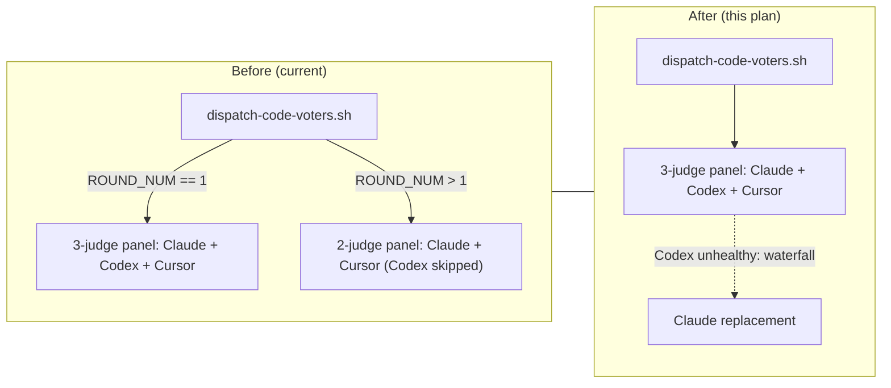

## Goal
Make the code-review voter panel unconditionally 3-judge on every round in both /implement Step 5 and standalone /review by removing round-number gating from dispatch-code-voters.sh

## Implementation Plan
# Plan — Stop shrinking judge panel; all 3 judges run on every round

## Plan

### Goal

Make the code-review voter panel unconditionally 3-judge (Claude + Codex + Cursor) on every round in both `/implement` Step 5 and standalone `/review`. Today, round 1 runs the full 3-judge panel and rounds 2+ omit the Codex voter, leaving a 2-judge panel (Claude + Cursor). That round-1-only gating (originally introduced by closed issue #2419) is removed; the existing waterfall continues to handle Codex unavailability via Claude replacement.

Scope: apply uniformly across both `/implement` Step 5 and `/review` standalone — they share `scripts/dispatch-code-voters.sh`, so a single fix point covers both.

### Files to modify

**Code:**

- **`scripts/dispatch-code-voters.sh`** — Remove every round-number branch that gates panel composition:
  - The `panel_intro` selector becomes a single unconditional "3-judge" string.
  - The slots-manifest write always writes both voter-2 (Codex) and voter-3 (Cursor) slots.
  - The override that forces `codex_present_for_waterfall="false"` on rounds 2+ is removed; `codex_present_for_waterfall` always equals `CODEX_AVAILABLE`.
  - The result-handling block collapses to the existing round-1 shape (no more `VOTER_2_STATUS=skipped`).
  - `expected_judges` becomes an unconditional `3`.
  - Inline comments describing the historical round-1-only gating are rewritten to state the new contract.
  - `--round-num` continues to be accepted and validated; the value is still used for breadcrumbs, retry logging, and per-round artifact paths.

- **`skills/review/scripts/review-core.sh`** — Update the comment block above the `dispatch-code-voters.sh` invocation to describe the unconditional 3-judge panel.

- **`scripts/test-dispatch-code-voters.sh`** — Rework the existing `--round-num 2` test section to assert the same 3-judge shape as round 1. Change the round-2 invocation from `--codex-available true --cursor-available false --round-num 2` to `--codex-available true --cursor-available true --round-num 2` so it directly proves "Codex stays on rounds 2+". Assert: manifest contains both `voter-2` and `voter-3` slots; `VOTER_2_STATUS` is `launched` or `fallback`, never `skipped`; Claude voter prompt contains the literal `3-judge voting panel`; no degraded-panel warning when both externals produce output.

- **`scripts/test-quick-mode-docs-sync.sh`** — Replace the positive marker entry that pins `3-judge panel on round 1` with a new marker capturing the post-fix contract (e.g., `3-judge panel on every round`, case-insensitive). Update the two self-test fixture sentences embedded near the bottom of the file so the new marker is present and the stale phrase is absent.

**Doc-only updates** (no behavior change):

- **`scripts/dispatch-code-voters.md`** — Sibling contract. Rewrite the round-1/rounds-2+ paragraph at the top, the `--round-num` flag description, the Voter 2/Voter 3 launch description, the `VOTER_*_STATUS` enum (drop `skipped`), and the `DEGRADED_PANEL_WARNING` paragraph (expected count is always 3). Preserve the `voter1_rc=1` API-error paragraph but drop its "2-judge fallback" recovery sentence.
- **`skills/implement/SKILL.md`** — Update the Step 5 banner template so the panel-description fragment reads `3-judge panel on every round (Claude+Codex+Cursor)`.
- **`skills/review/SKILL.md`** — Update the Step 3 voting-panel sentence to "A 3-judge panel (Claude + Codex + Cursor) votes on every round."
- **`README.md`** — Update the feature-matrix row that describes the Step 5 panel to a single unconditional description.
- **`docs/review-agents.md`** — Update Note A so the voting-panel fragment becomes a single "3-judge panel on every round (Claude opus + Codex + Cursor; Claude replacement when an external is unhealthy)" sentence. Leave the Phase 3 conflict-review table row untouched — that row describes a different code path and any drift between its prose and the actual conflict-review behavior is out of scope.
- **`docs/voting-process.md`** — Update the three places (`/review` panel intro sentence, the per-round table-anchored sentence, the table row for `/review` code review) to unconditional 3-voter descriptions.
- **`docs/skills.md`** — Update the `/implement` Step 5 description's voting-panel fragment to a single 3-judge unconditional sentence.
- **`docs/agents.md`** — Update the "Voters" paragraph to describe unconditional Codex participation.
- **`docs/topology.md`** — Update the test-pinned-phrase listing so the new phrase is named.
- **`scripts/test-quick-mode-docs-sync.md`** — Update the row in the marker table that describes the meaning of the renamed marker.
- **`scripts/generate-topology-docs.md`** — Update the listing of phrases pinned by `test-quick-mode-docs-sync.sh`.

### Approach

- The behavior is centralized in `scripts/dispatch-code-voters.sh`; making the panel composition unconditional there fixes both call sites (`/implement` Step 5 via `review-and-fix.sh` → `review-core.sh`, and `/review` standalone via `review-core.sh` directly).
- Use the existing round-1 branch as the unconditional shape — it's already the well-tested code path that produces the 3-judge panel.
- The Codex voter's runtime unavailability is already covered by the existing waterfall (Codex → Cursor → Claude per slot); no new fallback logic is needed.
- No env-var escape hatch is added to restore the old shrinking behavior.

### Edge cases

- **Codex unavailable session-wide**: Codex slot waterfalls to Claude on every round. `VOTER_2_TOOL=claude`, `VOTER_2_STATUS=fallback`.
- **Codex transiently unhealthy mid-run**: per-slot waterfall in `dispatch-with-waterfall.sh` triggers a Claude replacement for that round.
- **All externals down**: both Codex and Cursor slots waterfall to Claude. `expected_judges=3`, `effective_judges=3`.
- **`--round-num` validation failures**: unchanged — still hard-fail with the existing usage error.
- **Higher round numbers**: no special-case behavior; the same 3-judge panel runs.

### Failure modes

- **Incomplete update**: if `test-dispatch-code-voters.sh`'s round-2 section is updated but `test-quick-mode-docs-sync.sh`'s positive marker is not, CI fails. Mitigation: update both harnesses (and their embedded self-test fixtures) in the same commit as the doc edits.
- **Stale prose left somewhere**: a doc or comment that still says "Codex voter is omitted on rounds 2+" will silently misinform. Mitigation: post-fix grep for the canonical stale phrases (`omit Codex`, `2-judge panel on rounds 2+`, `rounds 2+ use a 2-judge`, `Codex voter omitted`) returning hits.
- **dispatch-with-waterfall.sh edge case**: changing `codex_present_for_waterfall` to always equal `CODEX_AVAILABLE` must keep producing valid manifests. Mitigation: keep the existing round-1 manifest-write block as the template; do not invent a new shape.

### Testing strategy

- **`scripts/test-dispatch-code-voters.sh`** — rework round-2 section to assert the 3-judge shape with `--codex-available true --cursor-available true --round-num 2`.
- **`scripts/test-quick-mode-docs-sync.sh`** — update positive marker and self-test fixtures.
- **Existing voting-tally / review-core / round-cap harnesses** — no changes expected; spot-check after the dispatch-code-voters.sh edits.
- **`bash scripts/relevant-checks.sh`** (or `make lint`) — standard pre-commit run.

## Architecture Diagram

## Acceptance

- `scripts/dispatch-code-voters.sh` contains no `ROUND_NUM == 1` or `ROUND_NUM > 1` branch that gates panel composition (manifest writes, `codex_present_for_waterfall`, `panel_intro`, result-handling, `expected_judges`). The script's panel composition is uniform across all round numbers.
- The script no longer emits `VOTER_2_STATUS=skipped` for any round.
- `scripts/test-dispatch-code-voters.sh`'s round-2 section passes with assertions that match the unconditional 3-judge shape (both `voter-2` and `voter-3` slots in the manifest; `3-judge voting panel` in the Claude prompt; no `VOTER_2_STATUS=skipped`).
- `scripts/test-quick-mode-docs-sync.sh` passes with its positive marker updated to capture the unconditional contract.
- `bash scripts/relevant-checks.sh` exits 0 from a clean working tree (after the edits).
- A repo-wide grep for `omit Codex`, `2-judge panel on rounds 2+`, `rounds 2+ use a 2-judge`, and `Codex voter omitted` returns no hits in `docs/`, `skills/`, `scripts/`, `README.md`. (Hits in `CHANGELOG.md` and `larch-logs/` are immutable history and are exempt.)
- `skills/shared/voting-protocol.md` is unchanged — it already (correctly) describes the unconditional contract; the fix aligns the code with the doc.

diff_lines: 90

## Test plan
(no test plan section in plan-file)
