## /implement run EAE67F5C-3248-4944-A02B-E4C5F941485D — bailed

- **Outcome**: bailed
- **Mode**: N/A
- **Duration**: 01:55:23
- **Cost**: 💰 TOTAL ~$53.97 — Claude $5.56, Codex $41.32, Cursor $4.07, Claude (subprocess) $3.02  |  Tokens: 87723k
- **Issue**: #4103 — https://github.com/character-ai/larch/issues/4103
- **Plan review**: N/A
- **Code review**: 2/4 accepted
- **Lines (PR diff)**: N/A
- **OOS filed**: 0
- **Exec issues**: 0
- **Warnings**: 0
- **Run logs**: `larch-logs/implement/EAE67F5C-3248-4944-A02B-E4C5F941485D/`

<!-- larch:run-summary v=1 -->

## Review Phase Detail

| Round | Suggestions | Accepted | OOS proposed | OOS accepted | Time | Cost | Reviewers |
|--:|--:|--:|--:|--:|:--|--:|--:|
| 1 | 16 | 3 | 0 | 0 | 1h 01m 19s | $25.50 | 10 |
| **Total** | **16** | **3** | **0** | **0** | **1h 01m 19s** | **$25.50** | **10** |

### Round 1 reviewer timing

```mermaid
gantt
    title Round 1 reviewer timing
    dateFormat X
    axisFormat %H:%M:%S
    section Reviewers
    codex/dyn-stall-state-auditor-codex :r1_t1, 3, 153
    cursor/dyn-ci-token-parity :r1_t2, 3, 179
    cursor/dyn-stall-state-auditor :r1_t3, 3, 181
    codex/dyn-ci-token-parity-codex :r1_t4, 3, 222
    cursor/testing :r1_t5, 3, 298
    cursor/correctness :r1_t6, 3, 326
    codex/edge-cases :r1_t7, 3, 333
    cursor/edge-cases :r1_t8, 3, 347
    codex/testing :r1_t9, 3, 369
    codex/correctness :r1_t10, 3, 437
    unknown/aggregator :r1_t11, 447, 582
    cursor/vote :r1_t12, 583, 686
    codex/vote :r1_t13, 583, 778
    claude/vote :r1_t14, 583, 960
    unknown/out :r1_t15, 3416, 3417
    cursor/ci.out :r1_t16, 3417, 3418
    unknown/claude.out :r1_t17, 3465, 3466
    unknown/codex.out :r1_t18, 3467, 3468
    claude/ci.out :r1_t19, 3468, 3469
    unknown/out :r1_t20, 3469, 3470
    cursor/ci.out :r1_t21, 3470, 3472
    unknown/codex.out :r1_t22, 3474, 3475
    unknown/out :r1_t23, 3476, 3477
    cursor/ci.out :r1_t24, 3477, 3478
    claude/ci.out :r1_t25, 3481, 3482
```

**Top reviewers** (by suggestions accepted, whole run):
1. codex/correctness — 2
2. codex/edge-cases — 1
3. cursor/dyn-ci-token-parity — 1
4. cursor/dyn-stall-state-auditor — 1

**Reviewer slot failures**: 0

_Cost is the per-round vendor cost (Codex + Cursor + Claude subprocess), attributed by token-ledger timestamp window; it excludes main-agent Claude, so it is less than the run Cost line above. Rendered as an em dash when per-round timing or the token ledger is unavailable._
