## /implement run F0498A95-005D-4E59-95D2-007831033442 — bailed

- **Outcome**: bailed
- **Mode**: N/A
- **Duration**: 00:28:48
- **Cost**: 💰 TOTAL ~$18.67 — Claude $1.81, Codex $11.43, Cursor $4.46, Claude (subprocess) $0.97  |  Tokens: 23991k
- **Issue**: #4067 — https://github.com/character-ai/larch/issues/4067
- **Plan review**: N/A
- **Code review**: 1/3 accepted
- **Lines (PR diff)**: N/A
- **OOS filed**: 0
- **Exec issues**: 0
- **Warnings**: 1
- **Run logs**: `larch-logs/implement/F0498A95-005D-4E59-95D2-007831033442/`

<!-- larch:run-summary v=1 -->

## Review Phase Detail

| Round | Suggestions | Accepted | OOS proposed | OOS accepted | Time | Cost | Reviewers |
|--:|--:|--:|--:|--:|:--|--:|--:|
| 1 | 8 | 1 | 0 | 0 | 13m 16s | $10.88 | 10 |
| **Total** | **8** | **1** | **0** | **0** | **13m 16s** | **$10.88** | **10** |

### Round 1 reviewer timing

```mermaid
gantt
    title Round 1 reviewer timing
    dateFormat X
    axisFormat %H:%M:%S
    section Reviewers
    codex/correctness :r1_t1, 2, 171
    cursor/testing :r1_t2, 2, 187
    cursor/edge-cases :r1_t3, 2, 205
    cursor/correctness :r1_t4, 2, 243
    codex/edge-cases :r1_t5, 2, 270
    cursor/dyn-gate-envelope :r1_t6, 3, 185
    cursor/dyn-step0-flow :r1_t7, 3, 196
    codex/testing :r1_t8, 3, 236
    codex/dyn-gate-envelope-codex :r1_t9, 3, 266
    codex/dyn-step0-flow-codex :r1_t10, 3, 282
    unknown/aggregator :r1_t11, 304, 401
    claude/vote :r1_t12, 402, 596
    cursor/vote :r1_t13, 403, 471
    codex/vote :r1_t14, 403, 574
```

**Top reviewers** (by suggestions accepted, whole run):
1. codex/correctness — 1
2. cursor/correctness — 1
3. cursor/dyn-gate-envelope — 1
4. cursor/dyn-step0-flow — 1

**Reviewer slot failures**: 0

_Cost is the per-round vendor cost (Codex + Cursor + Claude subprocess), attributed by token-ledger timestamp window; it excludes main-agent Claude, so it is less than the run Cost line above. Rendered as an em dash when per-round timing or the token ledger is unavailable._
