## /implement run F7390F8C-95BD-4C6E-AF11-BB2BA0F072AB — bailed

- **Outcome**: bailed
- **Mode**: N/A
- **Duration**: 02:26:30
- **Cost**: 💰 TOTAL ~$65.92 — Claude $9.58, Codex $26.54, Cursor $22.05, Claude (subprocess) $7.75  |  Tokens: 93565k
- **Issue**: #4013 — https://github.com/character-ai/larch/issues/4013
- **PR**: #4152 — https://github.com/character-ai/larch/pull/4152
- **Plan review**: N/A
- **Code review**: 22/25 accepted
- **Lines (PR diff)**: code +1224/-57, larch-logs +2691/-0
- **OOS filed**: 1 — https://github.com/character-ai/larch/issues/4148\n-
- **Exec issues**: 0
- **Warnings**: 0
- **Run logs**: `larch-logs/implement/F7390F8C-95BD-4C6E-AF11-BB2BA0F072AB/`

<!-- larch:run-summary v=1 -->

## Review Phase Detail

| Round | Suggestions | Accepted | OOS proposed | OOS accepted | Time | Cost | Reviewers |
|--:|--:|--:|--:|--:|:--|--:|--:|
| 1 | 10 | 8 | 0 | 0 | 26m 56s | $16.84 | 12 |
| 2 | 14 | 5 | 0 | 0 | 25m 41s | $8.63 | 6 |
| 3 | 13 | 4 | 0 | 0 | 23m 18s | $7.52 | 6 |
| 4 | 19 | 6 | 0 | 0 | 22m 30s | $10.14 | 6 |
| **Total** | **56** | **23** | **0** | **0** | **1h 38m 25s** | **$43.13** | **30** |

### Round 1 reviewer timing

```mermaid
gantt
    title Round 1 reviewer timing
    dateFormat X
    axisFormat %H:%M:%S
    section Reviewers
    unknown/scout-round1-manifest.json.raw :r1_t1, 1, 64
    unknown/scout-round1-manifest.json.raw :r1_t2, 64, 155
    cursor/dyn-absorbed-tail-state-machine :r1_t3, 157, 261
    codex/dyn-dep-pipeline-input-integrity-codex :r1_t4, 157, 276
    cursor/dyn-dep-pipeline-input-integrity :r1_t5, 157, 279
    cursor/dyn-apply-interface-backward-compat :r1_t6, 157, 301
    cursor/testing :r1_t7, 157, 308
    cursor/edge-cases :r1_t8, 157, 323
    codex/dyn-absorbed-tail-state-machine-codex :r1_t9, 157, 326
    codex/dyn-apply-interface-backward-compat-codex :r1_t10, 157, 331
    cursor/correctness :r1_t11, 157, 331
    codex/edge-cases :r1_t12, 157, 372
    codex/correctness :r1_t13, 157, 390
    codex/testing :r1_t14, 157, 484
    unknown/aggregator :r1_t15, 498, 557
    cursor/vote :r1_t16, 559, 639
    codex/vote :r1_t17, 559, 713
    claude/vote :r1_t18, 559, 906
    unknown/codex.log :r1_t19, 1225, 1253
    unknown/codex.log :r1_t20, 1387, 1407
    unknown/out :r1_t21, 1521, 1522
    cursor/ci.out :r1_t22, 1523, 1524
```

### Round 2 reviewer timing

```mermaid
gantt
    title Round 2 reviewer timing
    dateFormat X
    axisFormat %H:%M:%S
    section Reviewers
    unknown/scout-round2-manifest.json.raw :r2_t1, 1, 47
    unknown/scout-round2-manifest.json.raw :r2_t2, 48, 124
    cursor/testing :r2_t3, 125, 255
    cursor/correctness :r2_t4, 125, 322
    cursor/dyn-code-robustness :r2_t5, 125, 336
    cursor/edge-cases :r2_t6, 125, 349
    cursor/dyn-architecture :r2_t7, 125, 371
    codex/codex-generic :r2_t8, 125, 392
    unknown/aggregator :r2_t9, 402, 477
    cursor/vote :r2_t10, 478, 569
    codex/vote :r2_t11, 478, 673
    claude/vote :r2_t12, 478, 801
    unknown/codex.log :r2_t13, 1131, 1141
    unknown/codex.log :r2_t14, 1266, 1312
    unknown/codex.out :r2_t15, 1452, 1453
    claude/ci.out :r2_t16, 1453, 1454
    cursor/ci.out :r2_t17, 1456, 1457
```

### Round 3 reviewer timing

```mermaid
gantt
    title Round 3 reviewer timing
    dateFormat X
    axisFormat %H:%M:%S
    section Reviewers
    unknown/scout-round3-manifest.json.raw :r3_t1, 0, 51
    unknown/scout-round3-manifest.json.raw :r3_t2, 51, 181
    cursor/dyn-architecture :r3_t3, 183, 301
    cursor/correctness :r3_t4, 183, 340
    cursor/dyn-absorbed-tail-robustness :r3_t5, 183, 350
    cursor/edge-cases :r3_t6, 183, 352
    cursor/testing :r3_t7, 183, 368
    codex/codex-generic :r3_t8, 183, 408
    unknown/aggregator :r3_t9, 414, 463
    cursor/vote :r3_t10, 464, 521
    claude/vote :r3_t11, 464, 686
    codex/vote :r3_t12, 464, 696
    unknown/codex.log :r3_t13, 1010, 1037
    unknown/claude.out :r3_t14, 1243, 1244
    claude/ci.out :r3_t15, 1246, 1247
    unknown/out :r3_t16, 1250, 1251
    cursor/ci.out :r3_t17, 1251, 1253
```

### Round 4 reviewer timing

```mermaid
gantt
    title Round 4 reviewer timing
    dateFormat X
    axisFormat %H:%M:%S
    section Reviewers
    unknown/scout-round4-manifest.json.raw :r4_t1, 1, 50
    unknown/scout-round4-manifest.json.raw :r4_t2, 50, 115
    cursor/dyn-architecture :r4_t3, 116, 276
    cursor/edge-cases :r4_t4, 116, 295
    cursor/testing :r4_t5, 116, 307
    cursor/correctness :r4_t6, 116, 331
    cursor/dyn-robustness :r4_t7, 116, 393
    codex/codex-generic :r4_t8, 116, 571
    claude/ci.out :r4_t9, 280, 281
    unknown/out :r4_t10, 281, 282
    cursor/ci.out :r4_t11, 282, 284
    unknown/aggregator :r4_t12, 580, 670
    cursor/vote :r4_t13, 671, 740
    codex/vote :r4_t14, 671, 930
    claude/vote :r4_t15, 671, 994
    unknown/claude.out :r4_t16, 1237, 1238
    claude/ci.out :r4_t17, 1241, 1242
    cursor/ci.out :r4_t18, 1243, 1245
```

**Top reviewers** (by suggestions accepted, whole run):
1. cursor/correctness — 9
2. cursor/edge-cases — 5
3. codex/codex-generic — 4
4. codex/testing — 4
5. cursor/dyn-architecture — 4
6. cursor/testing — 4
7. codex/correctness — 3

**Reviewer slot failures**: 0

_Cost is the per-round vendor cost (Codex + Cursor + Claude subprocess), attributed by token-ledger timestamp window; it excludes main-agent Claude, so it is less than the run Cost line above. Rendered as an em dash when per-round timing or the token ledger is unavailable._
