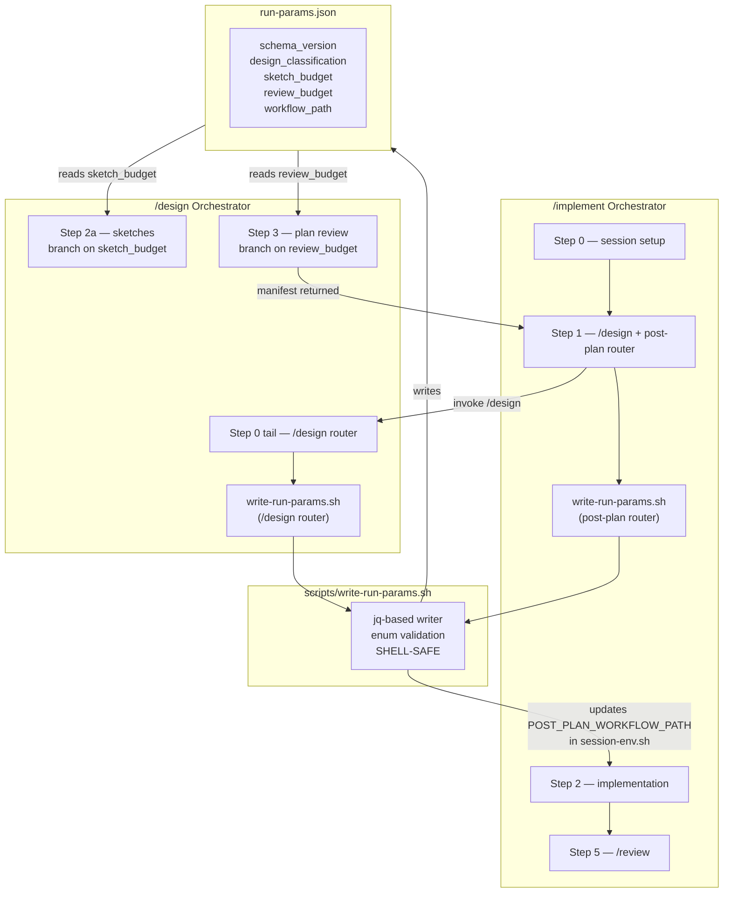
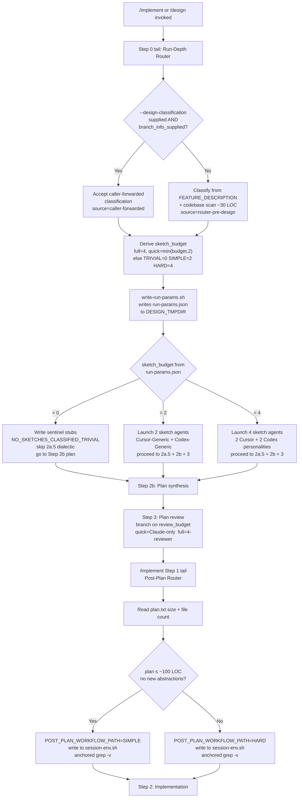

## Architecture Diagram

## Architecture Diagram

```mermaid
flowchart TD
    subgraph implement ["/implement Orchestrator"]
        I0["Step 0 — session setup"]
        I1["Step 1 — /design + post-plan router"]
        IRouter["write-run-params.sh\n(post-plan router)"]
        I2["Step 2 — implementation"]
        I5["Step 5 — /review"]
    end

    subgraph design ["/design Orchestrator"]
        D0["Step 0 tail — /design router"]
        DRouter["write-run-params.sh\n(/design router)"]
        D2a["Step 2a — sketches\nbranch on sketch_budget"]
        D3["Step 3 — plan review\nbranch on review_budget"]
    end

    subgraph artifact ["run-params.json"]
        RP["schema_version\ndesign_classification\nsketch_budget\nreview_budget\nworkflow_path"]
    end

    subgraph helper ["scripts/write-run-params.sh"]
        WRP["jq-based writer\nenum validation\nSHELL-SAFE"]
    end

    I0 --> I1
    I1 -->|"invoke /design"| D0
    D0 --> DRouter
    DRouter --> WRP
    WRP -->|"writes"| artifact
    artifact -->|"reads sketch_budget"| D2a
    artifact -->|"reads review_budget"| D3
    D3 -->|"manifest returned"| I1
    I1 --> IRouter
    IRouter --> WRP
    WRP -->|"updates POST_PLAN_WORKFLOW_PATH\nin session-env.sh"| I2
    I2 --> I5
```

## Code Flow Diagram

```mermaid
flowchart TD
    A["/implement or /design invoked"] --> B["Step 0 tail: Run-Depth Router"]
    B --> C{"--design-classification\nsupplied AND\nbranch_info_supplied?"}
    C -->|Yes| D["Accept caller-forwarded\nclassification\nsource=caller-forwarded"]
    C -->|No| E["Classify from FEATURE_DESCRIPTION\n+ codebase scan ~30 LOC\nsource=router-pre-design"]
    D --> F["Derive sketch_budget\nfull=4, quick=min(budget,2)\nelse TRIVIAL=0 SIMPLE=2 HARD=4"]
    E --> F
    F --> G["write-run-params.sh\nwrites run-params.json\nto DESIGN_TMPDIR"]
    G --> H{"sketch_budget from\nrun-params.json"}
    H -->|"= 0"| I["Write sentinel stubs\nNO_SKETCHES_CLASSIFIED_TRIVIAL\nskip 2a.5 dialectic\ngo to Step 2b plan"]
    H -->|"= 2"| J["Launch 2 sketch agents\nCursor-Generic + Codex-Generic\nproceed to 2a.5 + 2b + 3"]
    H -->|"= 4"| K["Launch 4 sketch agents\n2 Cursor + 2 Codex personalities\nproceed to 2a.5 + 2b + 3"]
    I --> L["Step 2b: Plan synthesis"]
    J --> L
    K --> L
    L --> M["Step 3: Plan review\nbranch on review_budget\nquick=Claude-only  full=4-reviewer"]
    M --> N["/implement Step 1 tail\nPost-Plan Router"]
    N --> O["Read plan.txt size + file count"]
    O --> P{"plan ≤ ~100 LOC\nno new abstractions?"}
    P -->|Yes| Q["POST_PLAN_WORKFLOW_PATH=SIMPLE\nwrite to session-env.sh\nanchored grep -v"]
    P -->|No| R["POST_PLAN_WORKFLOW_PATH=HARD\nwrite to session-env.sh\nanchored grep -v"]
    Q --> S["Step 2: Implementation"]
    R --> S
```
