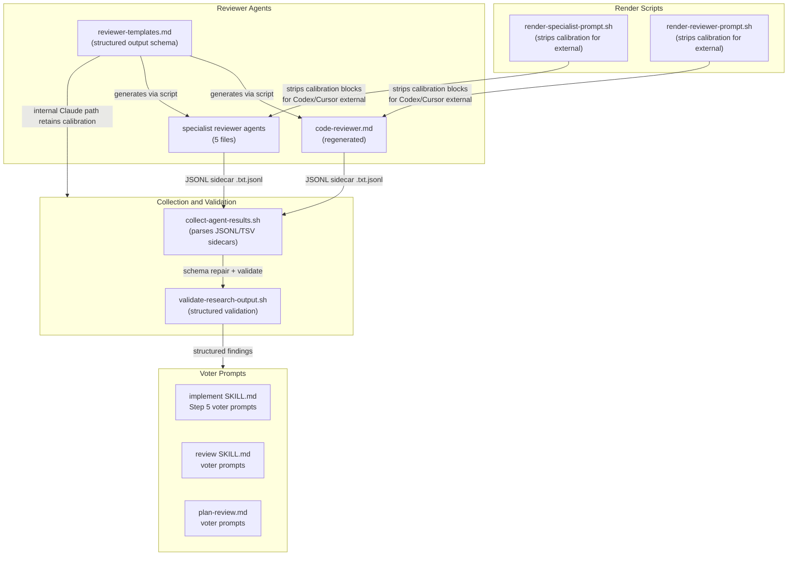
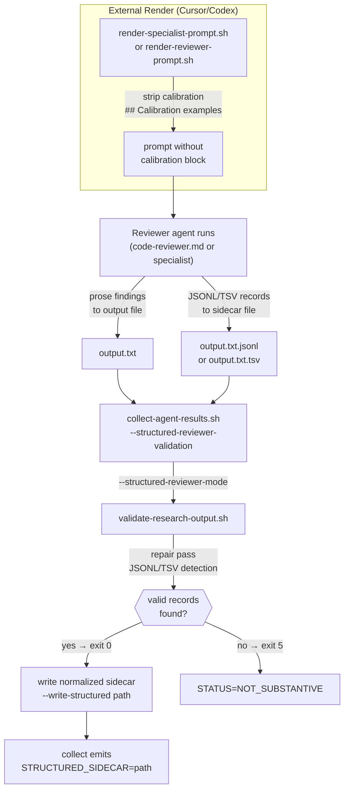

## Architecture Diagram

```mermaid
flowchart TD
    subgraph Reviewers["Reviewer Agents"]
        RT["reviewer-templates.md\n(structured output schema)"]
        CR["code-reviewer.md\n(regenerated)"]
        SR["specialist reviewer agents\n(5 files)"]
    end

    subgraph Render["Render Scripts"]
        RSP["render-specialist-prompt.sh\n(strips calibration for external)"]
        RRP["render-reviewer-prompt.sh\n(strips calibration for external)"]
    end

    subgraph Collect["Collection and Validation"]
        CAR["collect-agent-results.sh\n(parses JSONL/TSV sidecars)"]
        VRO["validate-research-output.sh\n(structured validation)"]
    end

    subgraph Voter["Voter Prompts"]
        IMP["implement SKILL.md\nStep 5 voter prompts"]
        REV["review SKILL.md\nvoter prompts"]
        PLR["plan-review.md\nvoter prompts"]
    end

    RT -->|"generates via script"| CR
    RT -->|"generates via script"| SR
    RT -->|"internal Claude path retains calibration"| Collect
    RSP -->|"strips calibration blocks\nfor Codex/Cursor external"| SR
    RRP -->|"strips calibration blocks\nfor Codex/Cursor external"| CR

    SR -->|"JSONL sidecar .txt.jsonl"| CAR
    CR -->|"JSONL sidecar .txt.jsonl"| CAR
    CAR -->|"schema repair + validate"| VRO
    VRO -->|"structured findings"| Voter
```

## Code Flow Diagram

```mermaid
flowchart TD
    A["Reviewer agent runs\n(code-reviewer.md or specialist)"] -->|"prose findings\nto output file"| B["output.txt"]
    A -->|"JSONL/TSV records\nto sidecar file"| C["output.txt.jsonl\nor output.txt.tsv"]

    B --> D["collect-agent-results.sh\n--structured-reviewer-validation"]
    C --> D

    D -->|"--structured-reviewer-mode"| E["validate-research-output.sh"]
    E -->|"repair pass\nJSONL/TSV detection"| F{{"valid records\nfound?"}}
    F -->|"yes → exit 0"| G["write normalized sidecar\n--write-structured path"]
    F -->|"no → exit 5"| H["STATUS=NOT_SUBSTANTIVE"]

    G --> I["collect emits\nSTRUCTURED_SIDECAR=path"]

    subgraph Render["External Render (Cursor/Codex)"]
        J["render-specialist-prompt.sh\nor render-reviewer-prompt.sh"] -->|"strip calibration\n## Calibration examples"| K["prompt without\ncalibration block"]
    end

    K --> A
```
