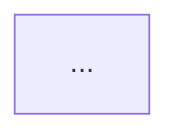

# compose-architecture-sketch.sh contract

`scripts/compose-architecture-sketch.sh` emits a minimal Mermaid
`flowchart LR` architecture sketch for the PR body, replacing the
`"Architecture diagram not available."` placeholder on SIMPLE-path
`/implement` runs where `/design` did not produce an architecture diagram.

Inputs:

- `--output PATH` (optional): write output to this file instead of
  stdout.

The script derives changed files from `git diff --name-only` against the
merge-base with `origin/main`. No flags are required; the working
directory must be inside the git repository.

Output structure (file or stdout):

```markdown
## Architecture Sketch


```

Sketch heuristics:

- **1 changed file**: single box `A["Edit basename"]`.
- **1 top-level directory, multiple files**: two-box `dir/ --> N files modified`.
- **Multiple directories** (up to 3): one box per directory.

The sketch is intentionally minimal (2-3 nodes). It is validated by
`scripts/sanitize-mermaid-fragment.sh` inside `ship-pr.sh` before
inclusion; on rejection, `ship-pr.sh` falls back to the placeholder.

The script exits non-zero when `git merge-base` fails, the merge-base is
empty, the diff fails, or no changed files are found. `ship-pr.sh`
treats any non-zero exit as a signal to use the placeholder.

Primary caller: `scripts/ship-pr.sh` `run_pr_prep_phase`.

Harness: `scripts/test-compose-architecture-sketch.sh`.
